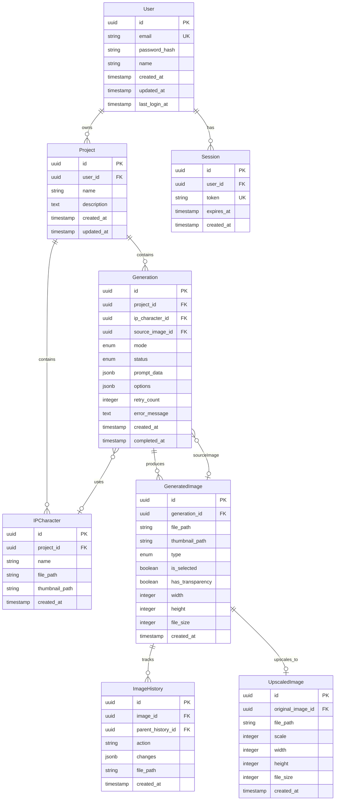

# ERD (Entity Relationship Diagram)
# AI 목업 이미지 프로그램 - 데이터베이스 설계 문서

## 문서 정보

| 항목 | 내용 |
|------|------|
| 문서 버전 | 1.0 |
| 작성일 | 2026-01-07 |
| 상태 | Draft |
| 데이터베이스 | PostgreSQL 16.x |
| ORM | Prisma 7.x |

---

## 1. 전체 ERD



---

## 2. 엔티티 상세 정의

### 2.1 User (사용자)

| 컬럼 | 타입 | 제약조건 | 설명 |
|------|------|----------|------|
| id | UUID | PK | 고유 식별자 |
| email | VARCHAR(255) | UNIQUE, NOT NULL | 이메일 (로그인 ID) |
| password_hash | VARCHAR(255) | NOT NULL | bcrypt 해시된 비밀번호 |
| name | VARCHAR(100) | NOT NULL | 사용자 이름 |
| created_at | TIMESTAMP | NOT NULL, DEFAULT NOW() | 가입일시 |
| updated_at | TIMESTAMP | NOT NULL | 정보 수정일시 |
| last_login_at | TIMESTAMP | | 마지막 로그인 일시 |

**인덱스:**
- `idx_user_email` - email (조회 성능)

---

### 2.2 Session (세션)

| 컬럼 | 타입 | 제약조건 | 설명 |
|------|------|----------|------|
| id | UUID | PK | 고유 식별자 |
| user_id | UUID | FK → User.id, NOT NULL | 사용자 참조 |
| token | VARCHAR(500) | UNIQUE, NOT NULL | JWT 토큰 |
| expires_at | TIMESTAMP | NOT NULL | 만료 일시 |
| created_at | TIMESTAMP | NOT NULL, DEFAULT NOW() | 생성일시 |

**인덱스:**
- `idx_session_token` - token (토큰 조회)
- `idx_session_user` - user_id (사용자별 세션 조회)
- `idx_session_expires` - expires_at (만료 세션 정리)

---

### 2.3 Project (프로젝트)

| 컬럼 | 타입 | 제약조건 | 설명 |
|------|------|----------|------|
| id | UUID | PK | 고유 식별자 |
| user_id | UUID | FK → User.id, NOT NULL | 소유자 참조 |
| name | VARCHAR(200) | NOT NULL | 프로젝트명 |
| description | TEXT | | 프로젝트 설명 |
| created_at | TIMESTAMP | NOT NULL, DEFAULT NOW() | 생성일시 |
| updated_at | TIMESTAMP | NOT NULL | 수정일시 |

**인덱스:**
- `idx_project_user` - user_id (사용자별 프로젝트 목록)
- `idx_project_created` - user_id, created_at DESC (최신순 정렬)

---

### 2.4 IPCharacter (IP 캐릭터)

| 컬럼 | 타입 | 제약조건 | 설명 |
|------|------|----------|------|
| id | UUID | PK | 고유 식별자 |
| project_id | UUID | FK → Project.id, NOT NULL | 프로젝트 참조 |
| name | VARCHAR(100) | NOT NULL | 캐릭터 이름 |
| file_path | VARCHAR(500) | NOT NULL | 원본 이미지 경로 |
| thumbnail_path | VARCHAR(500) | | 썸네일 경로 |
| created_at | TIMESTAMP | NOT NULL, DEFAULT NOW() | 등록일시 |

**인덱스:**
- `idx_character_project` - project_id (프로젝트별 캐릭터 목록)

---

### 2.5 Generation (생성 기록)

| 컬럼 | 타입 | 제약조건 | 설명 |
|------|------|----------|------|
| id | UUID | PK | 고유 식별자 |
| project_id | UUID | FK → Project.id, NOT NULL | 프로젝트 참조 |
| ip_character_id | UUID | FK → IPCharacter.id | 사용된 IP 캐릭터 |
| source_image_id | UUID | FK → GeneratedImage.id | 원본/참조 이미지 |
| mode | ENUM | NOT NULL | 'ip_change', 'sketch_to_real' |
| status | ENUM | NOT NULL, DEFAULT 'pending' | 'pending', 'processing', 'completed', 'failed' |
| prompt_data | JSONB | NOT NULL | 프롬프트 정보 |
| options | JSONB | NOT NULL, DEFAULT '{}' | 생성 옵션 |
| retry_count | INTEGER | NOT NULL, DEFAULT 0 | 재시도 횟수 |
| error_message | TEXT | | 에러 메시지 |
| created_at | TIMESTAMP | NOT NULL, DEFAULT NOW() | 요청일시 |
| completed_at | TIMESTAMP | | 완료일시 |

**ENUM 정의:**

```sql
-- 생성 모드
CREATE TYPE generation_mode AS ENUM ('ip_change', 'sketch_to_real');

-- 생성 상태
CREATE TYPE generation_status AS ENUM ('pending', 'processing', 'completed', 'failed');
```

**JSONB 스키마:**

```typescript
// prompt_data 구조
interface PromptData {
  userPrompt?: string;           // 사용자 입력 프롬프트
  systemPrompt: string;          // 시스템 프롬프트
  textureReference?: string;     // 참조 질감 이미지 경로
}

// options 구조
interface GenerationOptions {
  preserveStructure: boolean;    // 구조 우선 여부
  transparentBackground: boolean; // 투명 배경 여부
  outputCount: number;           // 생성 장수 (기본 2)
}
```

**인덱스:**
- `idx_generation_project` - project_id, created_at DESC
- `idx_generation_status` - status (대기 중 작업 조회)
- `idx_generation_character` - ip_character_id

---

### 2.6 GeneratedImage (생성된 이미지)

| 컬럼 | 타입 | 제약조건 | 설명 |
|------|------|----------|------|
| id | UUID | PK | 고유 식별자 |
| generation_id | UUID | FK → Generation.id, NOT NULL | 생성 기록 참조 |
| file_path | VARCHAR(500) | NOT NULL | 이미지 파일 경로 |
| thumbnail_path | VARCHAR(500) | | 썸네일 경로 |
| type | ENUM | NOT NULL | 'source', 'character', 'output', 'edited' |
| is_selected | BOOLEAN | NOT NULL, DEFAULT FALSE | 선택 여부 |
| has_transparency | BOOLEAN | NOT NULL, DEFAULT FALSE | 투명 배경 여부 |
| width | INTEGER | NOT NULL | 이미지 너비 (px) |
| height | INTEGER | NOT NULL | 이미지 높이 (px) |
| file_size | INTEGER | NOT NULL | 파일 크기 (bytes) |
| created_at | TIMESTAMP | NOT NULL, DEFAULT NOW() | 생성일시 |

**ENUM 정의:**

```sql
-- 이미지 타입
CREATE TYPE image_type AS ENUM (
  'source',      -- 원본 제품 이미지
  'character',   -- IP 캐릭터 이미지
  'texture',     -- 참조 질감 이미지
  'output',      -- 생성된 결과 이미지
  'edited'       -- 부분 수정된 이미지
);
```

**인덱스:**
- `idx_image_generation` - generation_id
- `idx_image_selected` - generation_id, is_selected (선택된 이미지 조회)

---

### 2.7 ImageHistory (이미지 히스토리)

| 컬럼 | 타입 | 제약조건 | 설명 |
|------|------|----------|------|
| id | UUID | PK | 고유 식별자 |
| image_id | UUID | FK → GeneratedImage.id, NOT NULL | 원본 이미지 참조 |
| parent_history_id | UUID | FK → ImageHistory.id | 부모 히스토리 (수정 체인) |
| action | VARCHAR(50) | NOT NULL | 수행된 액션 |
| changes | JSONB | | 변경 내용 |
| file_path | VARCHAR(500) | NOT NULL | 해당 버전 이미지 경로 |
| created_at | TIMESTAMP | NOT NULL, DEFAULT NOW() | 저장일시 |

**action 값:**
- `saved` - 히스토리에 저장
- `edited` - 부분 수정
- `ip_changed` - IP 변경으로 재생성

**인덱스:**
- `idx_history_image` - image_id, created_at DESC
- `idx_history_parent` - parent_history_id

---

### 2.8 UpscaledImage (업스케일 이미지)

| 컬럼 | 타입 | 제약조건 | 설명 |
|------|------|----------|------|
| id | UUID | PK | 고유 식별자 |
| original_image_id | UUID | FK → GeneratedImage.id, NOT NULL, UNIQUE | 원본 이미지 참조 |
| file_path | VARCHAR(500) | NOT NULL | 업스케일 이미지 경로 |
| scale | INTEGER | NOT NULL | 업스케일 배율 (2 = 2x) |
| width | INTEGER | NOT NULL | 업스케일 후 너비 |
| height | INTEGER | NOT NULL | 업스케일 후 높이 |
| file_size | INTEGER | NOT NULL | 파일 크기 (bytes) |
| created_at | TIMESTAMP | NOT NULL, DEFAULT NOW() | 생성일시 |

**인덱스:**
- `idx_upscaled_original` - original_image_id (UNIQUE)

---

## 3. Prisma 스키마

```prisma
// prisma/schema.prisma

generator client {
  provider = "prisma-client-js"
}

datasource db {
  provider = "postgresql"
  url      = env("DATABASE_URL")
}

// 사용자
model User {
  id           String    @id @default(uuid())
  email        String    @unique
  passwordHash String    @map("password_hash")
  name         String
  createdAt    DateTime  @default(now()) @map("created_at")
  updatedAt    DateTime  @updatedAt @map("updated_at")
  lastLoginAt  DateTime? @map("last_login_at")

  sessions Session[]
  projects Project[]

  @@map("users")
}

// 세션
model Session {
  id        String   @id @default(uuid())
  userId    String   @map("user_id")
  token     String   @unique
  expiresAt DateTime @map("expires_at")
  createdAt DateTime @default(now()) @map("created_at")

  user User @relation(fields: [userId], references: [id], onDelete: Cascade)

  @@index([userId])
  @@index([expiresAt])
  @@map("sessions")
}

// 프로젝트
model Project {
  id          String   @id @default(uuid())
  userId      String   @map("user_id")
  name        String
  description String?
  createdAt   DateTime @default(now()) @map("created_at")
  updatedAt   DateTime @updatedAt @map("updated_at")

  user        User          @relation(fields: [userId], references: [id], onDelete: Cascade)
  characters  IPCharacter[]
  generations Generation[]

  @@index([userId, createdAt(sort: Desc)])
  @@map("projects")
}

// IP 캐릭터
model IPCharacter {
  id            String   @id @default(uuid())
  projectId     String   @map("project_id")
  name          String
  filePath      String   @map("file_path")
  thumbnailPath String?  @map("thumbnail_path")
  createdAt     DateTime @default(now()) @map("created_at")

  project     Project      @relation(fields: [projectId], references: [id], onDelete: Cascade)
  generations Generation[]

  @@index([projectId])
  @@map("ip_characters")
}

// 생성 모드 열거형
enum GenerationMode {
  ip_change
  sketch_to_real

  @@map("generation_mode")
}

// 생성 상태 열거형
enum GenerationStatus {
  pending
  processing
  completed
  failed

  @@map("generation_status")
}

// 생성 기록
model Generation {
  id              String           @id @default(uuid())
  projectId       String           @map("project_id")
  ipCharacterId   String?          @map("ip_character_id")
  sourceImageId   String?          @map("source_image_id")
  mode            GenerationMode
  status          GenerationStatus @default(pending)
  promptData      Json             @map("prompt_data")
  options         Json             @default("{}")
  retryCount      Int              @default(0) @map("retry_count")
  errorMessage    String?          @map("error_message")
  createdAt       DateTime         @default(now()) @map("created_at")
  completedAt     DateTime?        @map("completed_at")

  project     Project          @relation(fields: [projectId], references: [id], onDelete: Cascade)
  ipCharacter IPCharacter?     @relation(fields: [ipCharacterId], references: [id], onDelete: SetNull)
  sourceImage GeneratedImage?  @relation("SourceImage", fields: [sourceImageId], references: [id], onDelete: SetNull)
  images      GeneratedImage[] @relation("GenerationImages")

  @@index([projectId, createdAt(sort: Desc)])
  @@index([status])
  @@index([ipCharacterId])
  @@map("generations")
}

// 이미지 타입 열거형
enum ImageType {
  source
  character
  texture
  output
  edited

  @@map("image_type")
}

// 생성된 이미지
model GeneratedImage {
  id              String    @id @default(uuid())
  generationId    String    @map("generation_id")
  filePath        String    @map("file_path")
  thumbnailPath   String?   @map("thumbnail_path")
  type            ImageType
  isSelected      Boolean   @default(false) @map("is_selected")
  hasTransparency Boolean   @default(false) @map("has_transparency")
  width           Int
  height          Int
  fileSize        Int       @map("file_size")
  createdAt       DateTime  @default(now()) @map("created_at")

  generation           Generation      @relation("GenerationImages", fields: [generationId], references: [id], onDelete: Cascade)
  usedAsSourceIn       Generation[]    @relation("SourceImage")
  history              ImageHistory[]
  upscaledImage        UpscaledImage?

  @@index([generationId])
  @@index([generationId, isSelected])
  @@map("generated_images")
}

// 이미지 히스토리
model ImageHistory {
  id              String   @id @default(uuid())
  imageId         String   @map("image_id")
  parentHistoryId String?  @map("parent_history_id")
  action          String
  changes         Json?
  filePath        String   @map("file_path")
  createdAt       DateTime @default(now()) @map("created_at")

  image         GeneratedImage @relation(fields: [imageId], references: [id], onDelete: Cascade)
  parentHistory ImageHistory?  @relation("HistoryChain", fields: [parentHistoryId], references: [id])
  childHistory  ImageHistory[] @relation("HistoryChain")

  @@index([imageId, createdAt(sort: Desc)])
  @@index([parentHistoryId])
  @@map("image_history")
}

// 업스케일 이미지
model UpscaledImage {
  id              String   @id @default(uuid())
  originalImageId String   @unique @map("original_image_id")
  filePath        String   @map("file_path")
  scale           Int
  width           Int
  height          Int
  fileSize        Int      @map("file_size")
  createdAt       DateTime @default(now()) @map("created_at")

  originalImage GeneratedImage @relation(fields: [originalImageId], references: [id], onDelete: Cascade)

  @@map("upscaled_images")
}
```

---

## 4. 마이그레이션 스크립트

### 4.1 초기 마이그레이션

```sql
-- migrations/001_initial.sql

-- UUID 확장 활성화
CREATE EXTENSION IF NOT EXISTS "uuid-ossp";

-- ENUM 타입 생성
CREATE TYPE generation_mode AS ENUM ('ip_change', 'sketch_to_real');
CREATE TYPE generation_status AS ENUM ('pending', 'processing', 'completed', 'failed');
CREATE TYPE image_type AS ENUM ('source', 'character', 'texture', 'output', 'edited');

-- Users 테이블
CREATE TABLE users (
    id UUID PRIMARY KEY DEFAULT uuid_generate_v4(),
    email VARCHAR(255) NOT NULL UNIQUE,
    password_hash VARCHAR(255) NOT NULL,
    name VARCHAR(100) NOT NULL,
    created_at TIMESTAMP NOT NULL DEFAULT NOW(),
    updated_at TIMESTAMP NOT NULL DEFAULT NOW(),
    last_login_at TIMESTAMP
);

CREATE INDEX idx_user_email ON users(email);

-- Sessions 테이블
CREATE TABLE sessions (
    id UUID PRIMARY KEY DEFAULT uuid_generate_v4(),
    user_id UUID NOT NULL REFERENCES users(id) ON DELETE CASCADE,
    token VARCHAR(500) NOT NULL UNIQUE,
    expires_at TIMESTAMP NOT NULL,
    created_at TIMESTAMP NOT NULL DEFAULT NOW()
);

CREATE INDEX idx_session_token ON sessions(token);
CREATE INDEX idx_session_user ON sessions(user_id);
CREATE INDEX idx_session_expires ON sessions(expires_at);

-- Projects 테이블
CREATE TABLE projects (
    id UUID PRIMARY KEY DEFAULT uuid_generate_v4(),
    user_id UUID NOT NULL REFERENCES users(id) ON DELETE CASCADE,
    name VARCHAR(200) NOT NULL,
    description TEXT,
    created_at TIMESTAMP NOT NULL DEFAULT NOW(),
    updated_at TIMESTAMP NOT NULL DEFAULT NOW()
);

CREATE INDEX idx_project_user ON projects(user_id);
CREATE INDEX idx_project_created ON projects(user_id, created_at DESC);

-- IP Characters 테이블
CREATE TABLE ip_characters (
    id UUID PRIMARY KEY DEFAULT uuid_generate_v4(),
    project_id UUID NOT NULL REFERENCES projects(id) ON DELETE CASCADE,
    name VARCHAR(100) NOT NULL,
    file_path VARCHAR(500) NOT NULL,
    thumbnail_path VARCHAR(500),
    created_at TIMESTAMP NOT NULL DEFAULT NOW()
);

CREATE INDEX idx_character_project ON ip_characters(project_id);

-- Generated Images 테이블 (Generations보다 먼저 생성 - 참조 때문)
CREATE TABLE generated_images (
    id UUID PRIMARY KEY DEFAULT uuid_generate_v4(),
    generation_id UUID NOT NULL,  -- FK는 나중에 추가
    file_path VARCHAR(500) NOT NULL,
    thumbnail_path VARCHAR(500),
    type image_type NOT NULL,
    is_selected BOOLEAN NOT NULL DEFAULT FALSE,
    has_transparency BOOLEAN NOT NULL DEFAULT FALSE,
    width INTEGER NOT NULL,
    height INTEGER NOT NULL,
    file_size INTEGER NOT NULL,
    created_at TIMESTAMP NOT NULL DEFAULT NOW()
);

-- Generations 테이블
CREATE TABLE generations (
    id UUID PRIMARY KEY DEFAULT uuid_generate_v4(),
    project_id UUID NOT NULL REFERENCES projects(id) ON DELETE CASCADE,
    ip_character_id UUID REFERENCES ip_characters(id) ON DELETE SET NULL,
    source_image_id UUID REFERENCES generated_images(id) ON DELETE SET NULL,
    mode generation_mode NOT NULL,
    status generation_status NOT NULL DEFAULT 'pending',
    prompt_data JSONB NOT NULL,
    options JSONB NOT NULL DEFAULT '{}',
    retry_count INTEGER NOT NULL DEFAULT 0,
    error_message TEXT,
    created_at TIMESTAMP NOT NULL DEFAULT NOW(),
    completed_at TIMESTAMP
);

CREATE INDEX idx_generation_project ON generations(project_id, created_at DESC);
CREATE INDEX idx_generation_status ON generations(status);
CREATE INDEX idx_generation_character ON generations(ip_character_id);

-- Generated Images FK 추가
ALTER TABLE generated_images 
    ADD CONSTRAINT fk_generated_images_generation 
    FOREIGN KEY (generation_id) REFERENCES generations(id) ON DELETE CASCADE;

CREATE INDEX idx_image_generation ON generated_images(generation_id);
CREATE INDEX idx_image_selected ON generated_images(generation_id, is_selected);

-- Image History 테이블
CREATE TABLE image_history (
    id UUID PRIMARY KEY DEFAULT uuid_generate_v4(),
    image_id UUID NOT NULL REFERENCES generated_images(id) ON DELETE CASCADE,
    parent_history_id UUID REFERENCES image_history(id),
    action VARCHAR(50) NOT NULL,
    changes JSONB,
    file_path VARCHAR(500) NOT NULL,
    created_at TIMESTAMP NOT NULL DEFAULT NOW()
);

CREATE INDEX idx_history_image ON image_history(image_id, created_at DESC);
CREATE INDEX idx_history_parent ON image_history(parent_history_id);

-- Upscaled Images 테이블
CREATE TABLE upscaled_images (
    id UUID PRIMARY KEY DEFAULT uuid_generate_v4(),
    original_image_id UUID NOT NULL UNIQUE REFERENCES generated_images(id) ON DELETE CASCADE,
    file_path VARCHAR(500) NOT NULL,
    scale INTEGER NOT NULL,
    width INTEGER NOT NULL,
    height INTEGER NOT NULL,
    file_size INTEGER NOT NULL,
    created_at TIMESTAMP NOT NULL DEFAULT NOW()
);

CREATE INDEX idx_upscaled_original ON upscaled_images(original_image_id);

-- Updated_at 자동 갱신 트리거
CREATE OR REPLACE FUNCTION update_updated_at_column()
RETURNS TRIGGER AS $$
BEGIN
    NEW.updated_at = NOW();
    RETURN NEW;
END;
$$ language 'plpgsql';

CREATE TRIGGER update_users_updated_at
    BEFORE UPDATE ON users
    FOR EACH ROW EXECUTE FUNCTION update_updated_at_column();

CREATE TRIGGER update_projects_updated_at
    BEFORE UPDATE ON projects
    FOR EACH ROW EXECUTE FUNCTION update_updated_at_column();
```

---

## 5. 쿼리 예시

### 5.1 프로젝트 목록 조회 (최신순)

```sql
SELECT 
    p.id,
    p.name,
    p.description,
    p.created_at,
    COUNT(DISTINCT g.id) as generation_count,
    COUNT(DISTINCT gi.id) FILTER (WHERE gi.is_selected = true) as saved_image_count
FROM projects p
LEFT JOIN generations g ON g.project_id = p.id
LEFT JOIN generated_images gi ON gi.generation_id = g.id
WHERE p.user_id = $1
GROUP BY p.id
ORDER BY p.created_at DESC
LIMIT 20 OFFSET $2;
```

### 5.2 프로젝트 히스토리 조회

```sql
SELECT 
    gi.id,
    gi.file_path,
    gi.thumbnail_path,
    gi.width,
    gi.height,
    gi.created_at,
    g.mode,
    ic.name as character_name
FROM generated_images gi
JOIN generations g ON g.id = gi.generation_id
LEFT JOIN ip_characters ic ON ic.id = g.ip_character_id
WHERE g.project_id = $1
  AND gi.is_selected = true
ORDER BY gi.created_at DESC;
```

### 5.3 대기 중인 생성 작업 조회

```sql
SELECT 
    g.id,
    g.project_id,
    g.mode,
    g.prompt_data,
    g.options,
    g.retry_count,
    g.created_at
FROM generations g
WHERE g.status = 'pending'
ORDER BY g.created_at ASC
LIMIT 10;
```

### 5.4 만료된 세션 정리

```sql
DELETE FROM sessions
WHERE expires_at < NOW();
```

---

## 6. 데이터 관계도 요약

```
User (사용자)
 ├── Session (세션) [1:N]
 └── Project (프로젝트) [1:N]
      ├── IPCharacter (IP 캐릭터) [1:N]
      └── Generation (생성 기록) [1:N]
           ├── uses → IPCharacter [N:1, optional]
           ├── sourceImage → GeneratedImage [N:1, optional]
           └── GeneratedImage (생성된 이미지) [1:N]
                ├── ImageHistory (히스토리) [1:N]
                │    └── parentHistory [self-reference]
                └── UpscaledImage (업스케일) [1:1, optional]
```

---

## 부록: 데이터 용량 예측

### 예상 데이터 크기 (사용자 20명, 1년 기준)

| 테이블 | 예상 레코드 수 | 평균 크기 | 총 크기 |
|--------|----------------|-----------|---------|
| users | 20 | 500B | 10KB |
| sessions | 1,000 | 200B | 200KB |
| projects | 200 | 500B | 100KB |
| ip_characters | 500 | 300B | 150KB |
| generations | 10,000 | 1KB | 10MB |
| generated_images | 20,000 | 500B | 10MB |
| image_history | 5,000 | 500B | 2.5MB |
| upscaled_images | 2,000 | 300B | 600KB |

**총 데이터베이스 크기**: 약 25MB

**이미지 파일 저장소**:
- 생성 이미지 (1K): 20,000 × 1.5MB = 30GB
- 업스케일 이미지 (2K): 2,000 × 6MB = 12GB
- **총 파일 저장소**: 약 50GB
