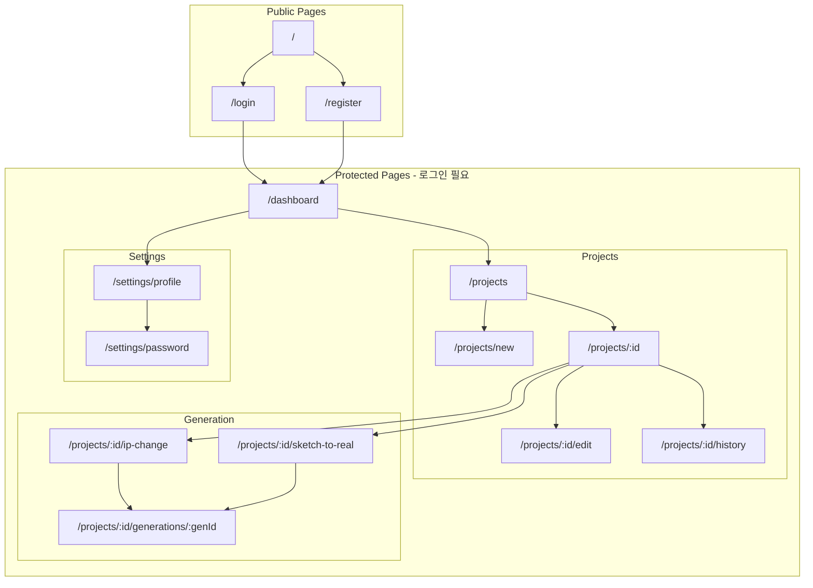

# IA (Information Architecture)
# AI 목업 이미지 프로그램 - 정보 구조 문서

## 문서 정보

| 항목 | 내용 |
|------|------|
| 문서 버전 | 1.0 |
| 작성일 | 2026-01-07 |
| 상태 | Draft |

---

## 1. 전체 사이트맵



---

## 2. URL 구조

### 2.1 라우트 정의

| 경로 | 페이지명 | 접근 권한 | 설명 |
|------|----------|-----------|------|
| `/` | 랜딩 | Public | 로그인 페이지로 리다이렉트 |
| `/login` | 로그인 | Public | 이메일/비밀번호 로그인 |
| `/register` | 회원가입 | Public | 신규 계정 생성 |
| `/dashboard` | 대시보드 | Protected | 메인 대시보드 |
| `/projects` | 프로젝트 목록 | Protected | 전체 프로젝트 리스트 |
| `/projects/new` | 프로젝트 생성 | Protected | 새 프로젝트 생성 폼 |
| `/projects/:id` | 프로젝트 상세 | Protected | 프로젝트 상세 및 작업 선택 |
| `/projects/:id/edit` | 프로젝트 수정 | Protected | 프로젝트 정보 수정 |
| `/projects/:id/history` | 히스토리 | Protected | 저장된 목업 갤러리 |
| `/projects/:id/ip-change` | IP 변경 | Protected | 캐릭터 IP 변경 작업 |
| `/projects/:id/sketch-to-real` | 스케치 실사화 | Protected | 스케치→실사 작업 |
| `/projects/:id/generations/:genId` | 생성 결과 | Protected | 생성 결과 상세 |
| `/settings/profile` | 프로필 설정 | Protected | 사용자 정보 수정 |
| `/settings/password` | 비밀번호 변경 | Protected | 비밀번호 변경 |

### 2.2 동적 라우트 파라미터

| 파라미터 | 타입 | 설명 | 예시 |
|----------|------|------|------|
| `:id` | UUID | 프로젝트 ID | `a1b2c3d4-...` |
| `:genId` | UUID | 생성 기록 ID | `e5f6g7h8-...` |

---

## 3. 네비게이션 구조

### 3.1 글로벌 네비게이션 (GNB)

```
┌─────────────────────────────────────────────────────────────┐
│  🎨 MockupAI          프로젝트  히스토리           [사용자명 ▼]  │
└─────────────────────────────────────────────────────────────┘
                                                      ├── 프로필 설정
                                                      ├── 비밀번호 변경
                                                      └── 로그아웃
```

| 메뉴 | 링크 | 표시 조건 |
|------|------|-----------|
| 로고 (MockupAI) | `/dashboard` | 항상 |
| 프로젝트 | `/projects` | 로그인 시 |
| 히스토리 | 현재 프로젝트의 `/projects/:id/history` | 프로젝트 선택 시 |
| 사용자 드롭다운 | - | 로그인 시 |

### 3.2 사이드바 네비게이션 (프로젝트 상세)

```
┌─────────────┐
│  📁 프로젝트  │
│  ───────────│
│  ⚡ IP 변경  │
│  ✏️ 스케치   │
│  📚 히스토리 │
│  ⚙️ 설정    │
└─────────────┘
```

| 메뉴 | 링크 | 아이콘 |
|------|------|--------|
| IP 변경 | `/projects/:id/ip-change` | ⚡ Zap |
| 스케치 실사화 | `/projects/:id/sketch-to-real` | ✏️ Pencil |
| 히스토리 | `/projects/:id/history` | 📚 Library |
| 설정 | `/projects/:id/edit` | ⚙️ Settings |

### 3.3 브레드크럼 네비게이션

| 페이지 | 브레드크럼 |
|--------|------------|
| 대시보드 | 홈 |
| 프로젝트 목록 | 홈 > 프로젝트 |
| 프로젝트 상세 | 홈 > 프로젝트 > {프로젝트명} |
| IP 변경 | 홈 > 프로젝트 > {프로젝트명} > IP 변경 |
| 생성 결과 | 홈 > 프로젝트 > {프로젝트명} > IP 변경 > 결과 |
| 히스토리 | 홈 > 프로젝트 > {프로젝트명} > 히스토리 |

---

## 4. 페이지별 구조

### 4.1 대시보드 (`/dashboard`)

```
┌─────────────────────────────────────────────────────────────┐
│  GNB                                                        │
├─────────────────────────────────────────────────────────────┤
│                                                             │
│  👋 안녕하세요, {사용자명}님!                                 │
│                                                             │
│  ┌─────────────────────────────────────────────────────┐   │
│  │  빠른 시작                                           │   │
│  │  ┌─────────┐  ┌─────────┐  ┌─────────┐              │   │
│  │  │ + 새    │  │ 최근    │  │ 최근    │              │   │
│  │  │ 프로젝트 │  │ 프로젝트1│  │ 프로젝트2│              │   │
│  │  └─────────┘  └─────────┘  └─────────┘              │   │
│  └─────────────────────────────────────────────────────┘   │
│                                                             │
│  ┌─────────────────────────────────────────────────────┐   │
│  │  최근 생성된 목업                                     │   │
│  │  ┌─────┐ ┌─────┐ ┌─────┐ ┌─────┐ ┌─────┐           │   │
│  │  │ img │ │ img │ │ img │ │ img │ │ img │           │   │
│  │  └─────┘ └─────┘ └─────┘ └─────┘ └─────┘           │   │
│  └─────────────────────────────────────────────────────┘   │
│                                                             │
└─────────────────────────────────────────────────────────────┘
```

**컴포넌트:**
- QuickStartSection: 빠른 시작 카드들
- RecentProjectsGrid: 최근 프로젝트 3개
- RecentMockupsGallery: 최근 생성 목업 미리보기

---

### 4.2 프로젝트 목록 (`/projects`)

```
┌─────────────────────────────────────────────────────────────┐
│  GNB                                                        │
├─────────────────────────────────────────────────────────────┤
│                                                             │
│  프로젝트                              [+ 새 프로젝트] [정렬▼]│
│  ─────────────────────────────────────────────────────────  │
│                                                             │
│  ┌──────────────┐ ┌──────────────┐ ┌──────────────┐        │
│  │ 📁 2026 봄    │ │ 📁 캐릭터    │ │ 📁 피규어    │        │
│  │    신상품     │ │    텀블러    │ │    테스트    │        │
│  │              │ │              │ │              │        │
│  │ 목업 32개    │ │ 목업 18개    │ │ 목업 5개     │        │
│  │ 1월 5일 수정 │ │ 1월 3일 수정 │ │ 12월 28일   │        │
│  └──────────────┘ └──────────────┘ └──────────────┘        │
│                                                             │
│  ┌──────────────┐ ┌──────────────┐                         │
│  │ 📁 봉제인형   │ │ 📁 키링     │                         │
│  │    라인      │ │    시리즈    │                         │
│  └──────────────┘ └──────────────┘                         │
│                                                             │
│  ─────────── 1 / 3 페이지 ───────────                       │
│                                                             │
└─────────────────────────────────────────────────────────────┘
```

**기능:**
- 프로젝트 카드 그리드 뷰
- 정렬: 최신순 / 이름순 / 목업 수
- 페이지네이션
- 프로젝트 생성 버튼

---

### 4.3 프로젝트 상세 (`/projects/:id`)

```
┌─────────────────────────────────────────────────────────────┐
│  GNB                                                        │
├─────────┬───────────────────────────────────────────────────┤
│         │                                                   │
│ 사이드바 │  2026 봄 신상품                        [⚙️ 설정]  │
│         │  ─────────────────────────────────────────────    │
│ ⚡ IP변경│                                                   │
│ ✏️ 스케치│  작업을 선택하세요                                 │
│ 📚 히스토리│                                                  │
│ ⚙️ 설정 │  ┌────────────────────┐ ┌────────────────────┐    │
│         │  │                    │ │                    │    │
│         │  │   ⚡ IP 변경       │ │   ✏️ 스케치 실사화   │    │
│         │  │                    │ │                    │    │
│         │  │ 기존 제품의 캐릭터를│ │ 2D 스케치를 실제   │    │
│         │  │ 새로운 IP로 변경   │ │ 제품처럼 변환      │    │
│         │  │                    │ │                    │    │
│         │  └────────────────────┘ └────────────────────┘    │
│         │                                                   │
│         │  ─────────────────────────────────────────────    │
│         │                                                   │
│         │  최근 작업                              [더보기 →] │
│         │  ┌─────┐ ┌─────┐ ┌─────┐ ┌─────┐                 │
│         │  │ img │ │ img │ │ img │ │ img │                 │
│         │  └─────┘ └─────┘ └─────┘ └─────┘                 │
│         │                                                   │
└─────────┴───────────────────────────────────────────────────┘
```

---

### 4.4 IP 변경 작업 (`/projects/:id/ip-change`)

```
┌─────────────────────────────────────────────────────────────┐
│  GNB                                                        │
├─────────┬───────────────────────────────────────────────────┤
│         │                                                   │
│ 사이드바 │  IP 변경                                          │
│         │  ─────────────────────────────────────────────    │
│         │                                                   │
│         │  Step 1: 이미지 업로드                             │
│         │                                                   │
│         │  ┌─────────────────┐   ┌─────────────────┐       │
│         │  │                 │   │                 │       │
│         │  │  원본 제품 이미지  │   │  새 캐릭터 IP   │       │
│         │  │                 │   │                 │       │
│         │  │  [📁 업로드]    │   │  [📁 업로드]    │       │
│         │  │                 │   │  또는 [기존 선택]│       │
│         │  └─────────────────┘   └─────────────────┘       │
│         │                                                   │
│         │  Step 2: 옵션 설정                                 │
│         │  ┌─────────────────────────────────────────┐     │
│         │  │ ☑ 투명 배경으로 생성                     │     │
│         │  │ ☐ 구조 우선 (형태 엄격히 유지)           │     │
│         │  │                                         │     │
│         │  │ 추가 프롬프트 (선택)                     │     │
│         │  │ ┌─────────────────────────────────┐    │     │
│         │  │ │                                 │    │     │
│         │  │ └─────────────────────────────────┘    │     │
│         │  └─────────────────────────────────────────┘     │
│         │                                                   │
│         │              [ 목업 생성하기 ]                     │
│         │                                                   │
└─────────┴───────────────────────────────────────────────────┘
```

---

### 4.5 생성 결과 (`/projects/:id/generations/:genId`)

```
┌─────────────────────────────────────────────────────────────┐
│  GNB                                                        │
├─────────┬───────────────────────────────────────────────────┤
│         │                                                   │
│ 사이드바 │  생성 결과                              [← 뒤로]  │
│         │  ─────────────────────────────────────────────    │
│         │                                                   │
│         │  2장 중 마음에 드는 이미지를 선택하세요              │
│         │                                                   │
│         │  ┌─────────────────┐   ┌─────────────────┐       │
│         │  │                 │   │                 │       │
│         │  │                 │   │                 │       │
│         │  │   결과 이미지 1   │   │   결과 이미지 2   │       │
│         │  │                 │   │                 │       │
│         │  │                 │   │                 │       │
│         │  │  ○ 선택         │   │  ○ 선택         │       │
│         │  └─────────────────┘   └─────────────────┘       │
│         │                                                   │
│         │  ─────────────────────────────────────────────    │
│         │                                                   │
│         │  선택한 이미지 액션:                               │
│         │  [💾 저장] [✏️ 부분수정] [⬇️ 다운로드] [🔄 재생성]  │
│         │                                                   │
└─────────┴───────────────────────────────────────────────────┘
```

---

### 4.6 히스토리 (`/projects/:id/history`)

```
┌─────────────────────────────────────────────────────────────┐
│  GNB                                                        │
├─────────┬───────────────────────────────────────────────────┤
│         │                                                   │
│ 사이드바 │  히스토리                      [정렬▼] [필터▼]    │
│         │  ─────────────────────────────────────────────    │
│         │                                                   │
│         │  ┌─────┐ ┌─────┐ ┌─────┐ ┌─────┐ ┌─────┐        │
│         │  │     │ │     │ │     │ │     │ │     │        │
│         │  │ img │ │ img │ │ img │ │ img │ │ img │        │
│         │  │     │ │     │ │     │ │     │ │     │        │
│         │  ├─────┤ ├─────┤ ├─────┤ ├─────┤ ├─────┤        │
│         │  │01/05│ │01/04│ │01/03│ │01/02│ │01/01│        │
│         │  └─────┘ └─────┘ └─────┘ └─────┘ └─────┘        │
│         │                                                   │
│         │  ┌─────┐ ┌─────┐ ┌─────┐ ┌─────┐ ┌─────┐        │
│         │  │ img │ │ img │ │ img │ │ img │ │ img │        │
│         │  └─────┘ └─────┘ └─────┘ └─────┘ └─────┘        │
│         │                                                   │
│         │  ─────────── 더 불러오기 ───────────              │
│         │                                                   │
└─────────┴───────────────────────────────────────────────────┘
```

**기능:**
- 무한 스크롤 갤러리
- 정렬: 최신순 / 오래된순
- 필터: 모드별 (IP변경 / 스케치)
- 이미지 클릭 시 상세 모달

---

### 4.7 이미지 상세 모달

```
┌─────────────────────────────────────────────────────────────┐
│                                                       [✕]   │
│  ┌───────────────────────────────────────────────────────┐ │
│  │                                                       │ │
│  │                                                       │ │
│  │                                                       │ │
│  │                   이미지 미리보기                      │ │
│  │                     (확대 가능)                       │ │
│  │                                                       │ │
│  │                                                       │ │
│  │                                                       │ │
│  └───────────────────────────────────────────────────────┘ │
│                                                             │
│  생성 정보                                                  │
│  ─────────────────────────────────────────────────────────  │
│  모드: IP 변경                                              │
│  캐릭터: 브라운                                             │
│  생성일: 2026-01-05 14:32                                  │
│  해상도: 1024 x 1024                                       │
│                                                             │
│  ───────────────────────────────────────────────────────── │
│                                                             │
│  [🔄 IP만 변경] [✏️ 부분수정] [⬇️ 1K] [⬇️ 2K] [🗑️ 삭제]    │
│                                                             │
└─────────────────────────────────────────────────────────────┘
```

---

## 5. 반응형 브레이크포인트

| 브레이크포인트 | 너비 | 레이아웃 |
|----------------|------|----------|
| Mobile | < 640px | 단일 컬럼, 사이드바 숨김 |
| Tablet | 640px ~ 1024px | 2컬럼 그리드, 접히는 사이드바 |
| Desktop | 1024px ~ 1440px | 풀 레이아웃, 고정 사이드바 |
| Wide | > 1440px | 최대 너비 제한 (1440px) |

### 5.1 모바일 네비게이션

```
┌─────────────────────────────┐
│  ☰  MockupAI        [👤]   │
├─────────────────────────────┤
│                             │
│  콘텐츠 영역                 │
│                             │
├─────────────────────────────┤
│  [🏠] [📁] [➕] [📚] [⚙️]   │
└─────────────────────────────┘
  홈  프로젝트 생성 히스토리 설정
```

---

## 6. 모달 & 오버레이

### 6.1 모달 목록

| 모달 | 트리거 | 내용 |
|------|--------|------|
| 프로젝트 생성 | "새 프로젝트" 버튼 | 이름, 설명 입력 폼 |
| 이미지 상세 | 히스토리 이미지 클릭 | 이미지 확대 및 액션 |
| 부분 수정 | "부분수정" 버튼 | 수정 프롬프트 입력 |
| 다운로드 옵션 | "다운로드" 버튼 | 해상도 선택 |
| 삭제 확인 | "삭제" 버튼 | 삭제 확인 다이얼로그 |
| IP 캐릭터 선택 | "기존 캐릭터 선택" | 등록된 캐릭터 목록 |

### 6.2 토스트 알림

| 타입 | 메시지 예시 | 지속시간 |
|------|-------------|----------|
| Success | "목업이 저장되었습니다" | 3초 |
| Error | "이미지 생성에 실패했습니다" | 5초 |
| Info | "업스케일 중입니다..." | 작업 완료까지 |
| Warning | "용량이 부족합니다" | 5초 |

---

## 7. 상태 관리 구조

### 7.1 글로벌 상태

```typescript
// Zustand 스토어 구조

interface AppStore {
  // 인증 상태
  auth: {
    user: User | null;
    isLoading: boolean;
    login: (email: string, password: string) => Promise<void>;
    logout: () => void;
  };
  
  // 현재 프로젝트
  currentProject: {
    project: Project | null;
    setProject: (project: Project) => void;
    clearProject: () => void;
  };
  
  // UI 상태
  ui: {
    sidebarOpen: boolean;
    activeModal: ModalType | null;
    toggleSidebar: () => void;
    openModal: (type: ModalType) => void;
    closeModal: () => void;
  };
}
```

### 7.2 서버 상태 (TanStack Query)

```typescript
// Query Keys
const queryKeys = {
  projects: ['projects'] as const,
  project: (id: string) => ['projects', id] as const,
  generations: (projectId: string) => ['projects', projectId, 'generations'] as const,
  history: (projectId: string) => ['projects', projectId, 'history'] as const,
  characters: (projectId: string) => ['projects', projectId, 'characters'] as const,
};
```

---

## 8. 접근성 (A11y) 구조

### 8.1 랜드마크 영역

```html
<header role="banner">      <!-- GNB -->
<nav role="navigation">     <!-- 사이드바 -->
<main role="main">          <!-- 메인 콘텐츠 -->
<aside role="complementary"> <!-- 보조 정보 -->
<footer role="contentinfo"> <!-- 푸터 (있는 경우) -->
```

### 8.2 ARIA 레이블

| 요소 | ARIA | 설명 |
|------|------|------|
| 사이드바 토글 | `aria-expanded`, `aria-controls` | 열림/닫힘 상태 |
| 이미지 선택 | `aria-selected` | 선택된 이미지 표시 |
| 로딩 상태 | `aria-busy`, `aria-live` | 진행 상태 알림 |
| 모달 | `aria-modal`, `aria-labelledby` | 모달 접근성 |
| 탭 네비게이션 | `role="tablist"`, `role="tab"` | 탭 패널 |

---

## 부록: 페이지별 컴포넌트 매핑

| 페이지 | 주요 컴포넌트 |
|--------|---------------|
| 로그인 | LoginForm, SocialLoginButtons |
| 대시보드 | QuickStartCards, RecentProjects, RecentMockups |
| 프로젝트 목록 | ProjectGrid, ProjectCard, Pagination |
| 프로젝트 상세 | Sidebar, ModeSelector, RecentWork |
| IP 변경 | ImageUploader, OptionsForm, GenerateButton |
| 스케치 실사화 | ImageUploader, TextureSelector, OptionsForm |
| 생성 결과 | ImageComparison, ActionButtons, EditModal |
| 히스토리 | InfiniteGallery, ImageCard, FilterBar |
| 설정 | ProfileForm, PasswordForm |
