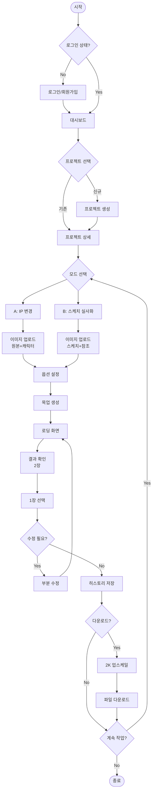
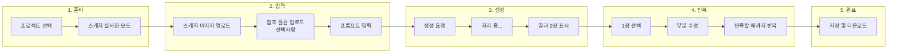
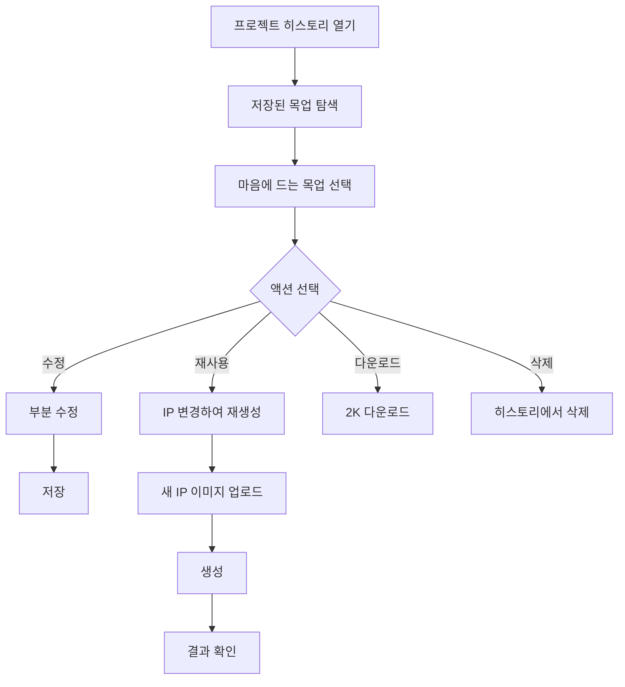
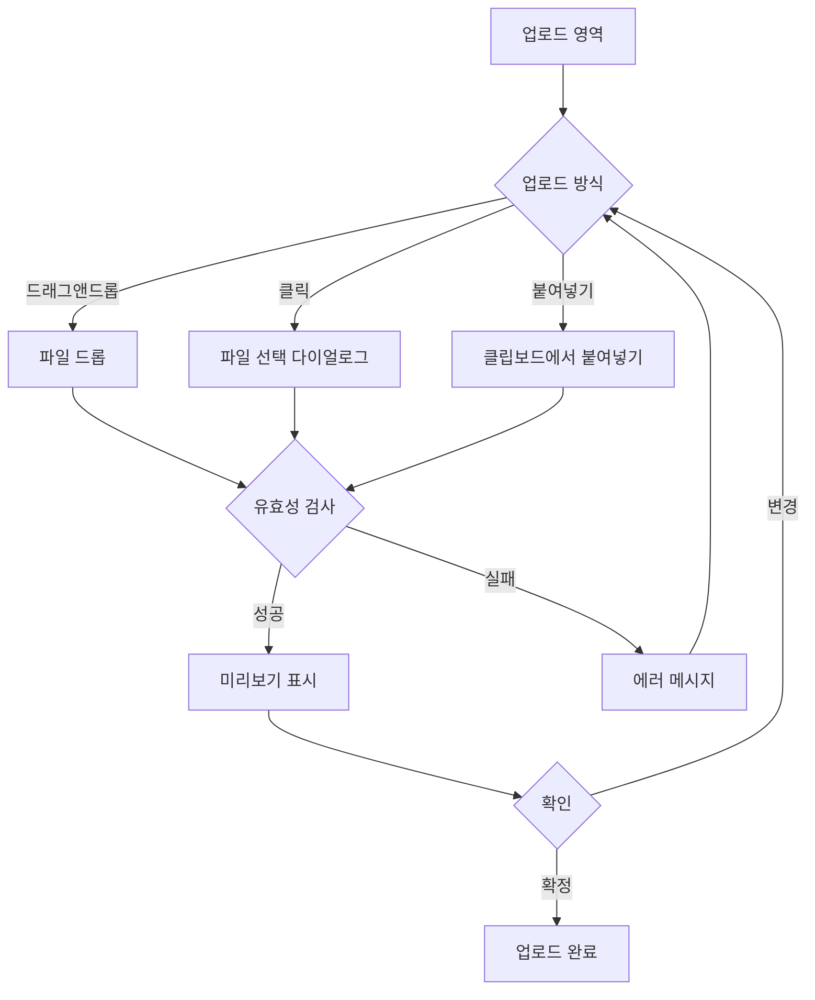
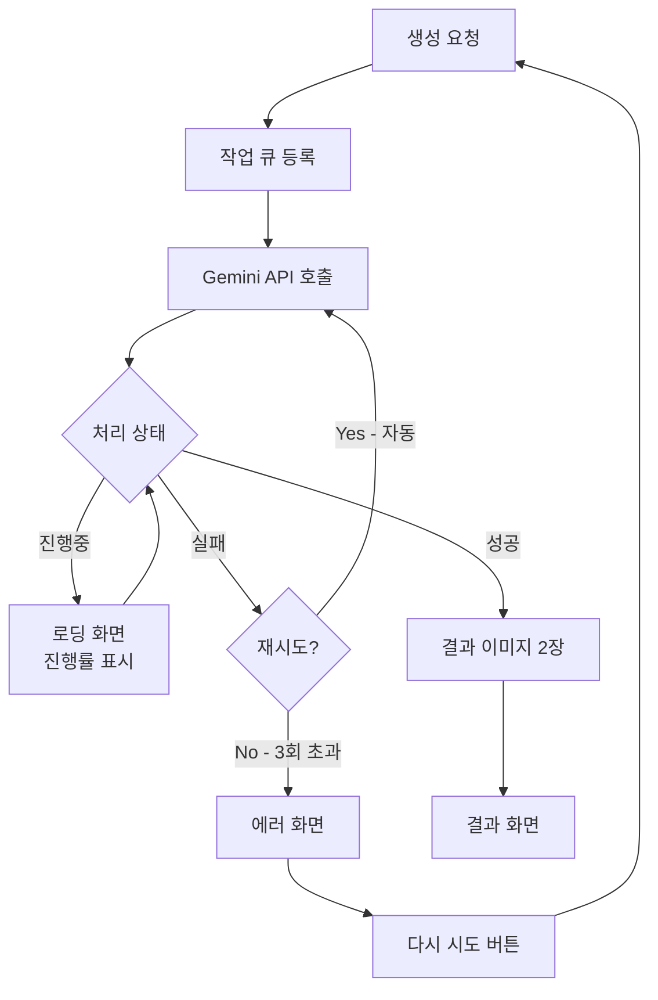
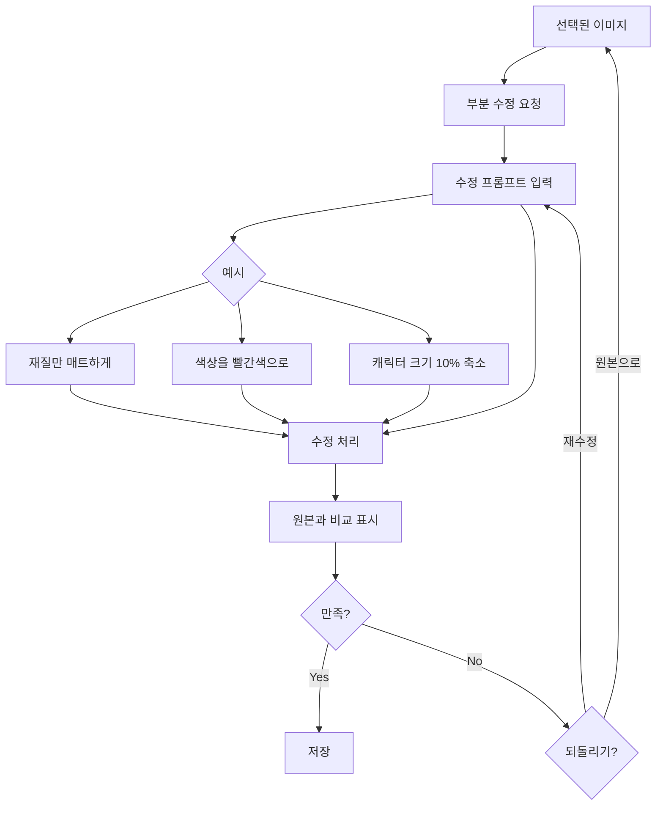
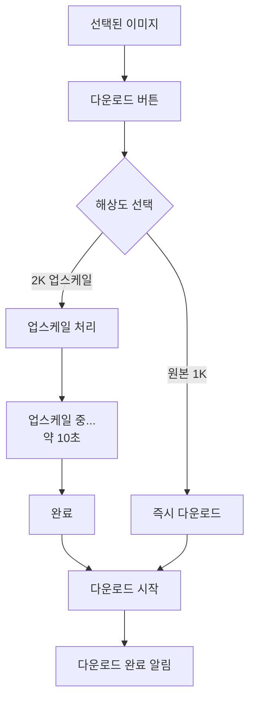
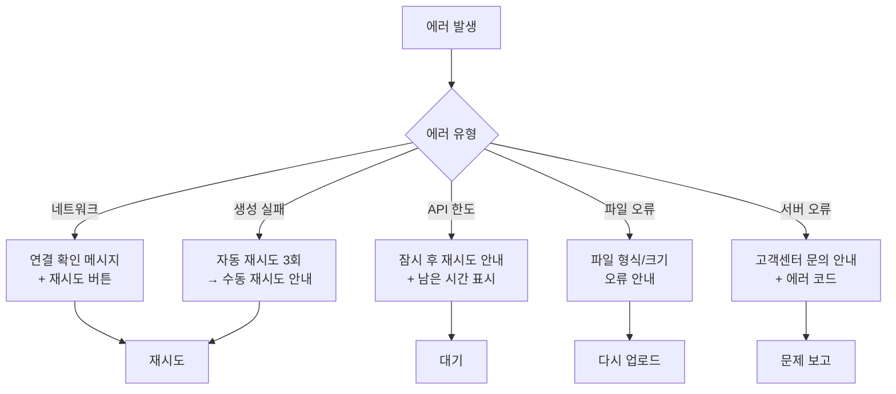
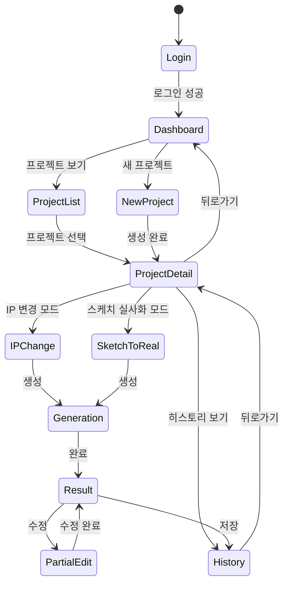

# User Journey
# AI 목업 이미지 프로그램 - 사용자 여정 문서

## 문서 정보

| 항목 | 내용 |
|------|------|
| 문서 버전 | 1.0 |
| 작성일 | 2026-01-07 |
| 상태 | Draft |

---

## 1. 사용자 여정 개요

### 1.1 핵심 사용자 플로우



---

## 2. 상세 사용자 여정

### 2.1 Journey A: 캐릭터 IP 변경

**시나리오**: 디자이너가 기존 인기 제품에 새로운 캐릭터 IP를 적용한 목업을 생성

```mermaid
flowchart LR
    subgraph phase1 [1. 준비]
        A1[프로젝트 선택/생성]
        A2[IP 변경 모드 선택]
    end
    
    subgraph phase2 [2. 입력]
        B1[원본 제품 이미지 업로드]
        B2[새 캐릭터 IP 업로드]
        B3[옵션 설정]
    end
    
    subgraph phase3 [3. 생성]
        C1[생성 요청]
        C2[처리 중...]
        C3[결과 2장 표시]
    end
    
    subgraph phase4 [4. 선택/수정]
        D1[1장 선택]
        D2[부분 수정 요청]
        D3[수정 결과 확인]
    end
    
    subgraph phase5 [5. 저장]
        E1[히스토리 저장]
        E2[2K 다운로드]
    end
    
    A1 --> A2 --> B1 --> B2 --> B3 --> C1 --> C2 --> C3 --> D1 --> D2 --> D3 --> E1 --> E2
```



#### 단계별 상세

| 단계 | 화면 | 사용자 행동 | 시스템 반응 | 감정 상태 |
|------|------|-------------|-------------|-----------|
| 1 | 대시보드 | 프로젝트 선택 또는 생성 | 프로젝트 상세 페이지 이동 | 중립 |
| 2 | 프로젝트 상세 | "IP 변경" 모드 클릭 | 업로드 화면 표시 | 기대 |
| 3 | 업로드 | 원본 제품 이미지 드래그&드롭 | 이미지 미리보기 표시 | 집중 |
| 4 | 업로드 | 새 캐릭터 IP 이미지 업로드 | 이미지 미리보기 표시 | 집중 |
| 5 | 옵션 | 투명 배경, 구조 우선 등 선택 | 옵션 저장 | 중립 |
| 6 | 생성 | "생성하기" 버튼 클릭 | 로딩 애니메이션 | 기대/긴장 |
| 7 | 결과 | 2장 결과물 확인 | 나란히 비교 뷰 | 흥미/평가 |
| 8 | 결과 | 마음에 드는 1장 클릭 | 선택 표시, 확대 뷰 | 만족/불만 |
| 9 | 수정 | "재질만 매트하게" 입력 | 부분 수정 처리 | 기대 |
| 10 | 결과 | 수정 결과 확인 | 수정된 이미지 표시 | 만족 |
| 11 | 저장 | "저장" 버튼 클릭 | 히스토리에 저장 완료 | 안도 |
| 12 | 다운로드 | "2K 다운로드" 클릭 | 업스케일 후 다운로드 | 완료감 |

---

### 2.2 Journey B: 스케치 → 실사화

**시나리오**: 디자이너가 손으로 그린 머그컵 스케치를 실제 제품 목업으로 변환



#### 입력 화면 상세

```
┌─────────────────────────────────────────────────────┐
│  스케치 → 실사화                                      │
├─────────────────────────────────────────────────────┤
│                                                     │
│  ┌─────────────────┐    ┌─────────────────┐        │
│  │                 │    │                 │        │
│  │   스케치 이미지   │    │  참조 질감 이미지  │        │
│  │   (필수)        │    │  (선택)         │        │
│  │                 │    │                 │        │
│  │  [이미지 업로드]  │    │  [이미지 업로드]  │        │
│  └─────────────────┘    └─────────────────┘        │
│                                                     │
│  ┌─────────────────────────────────────────────┐   │
│  │ 추가 설명 (선택)                              │   │
│  │ 예: 광택 있는 도자기 재질, 파스텔 색감         │   │
│  └─────────────────────────────────────────────┘   │
│                                                     │
│  ☑ 투명 배경으로 생성                               │
│  ☐ 구조 우선 (스케치 형태 엄격히 유지)               │
│                                                     │
│              [ 목업 생성하기 ]                       │
│                                                     │
└─────────────────────────────────────────────────────┘
```

---

### 2.3 Journey C: 히스토리 관리

**시나리오**: 이전에 생성한 목업을 불러와 IP만 변경하여 재사용



#### 히스토리 화면 레이아웃

```
┌─────────────────────────────────────────────────────┐
│  프로젝트: 2026 봄 신상품                   [정렬 ▼]  │
├─────────────────────────────────────────────────────┤
│                                                     │
│  ┌─────┐  ┌─────┐  ┌─────┐  ┌─────┐  ┌─────┐      │
│  │     │  │     │  │     │  │     │  │     │      │
│  │ 목업1 │  │ 목업2 │  │ 목업3 │  │ 목업4 │  │ 목업5 │      │
│  │     │  │     │  │     │  │     │  │     │      │
│  ├─────┤  ├─────┤  ├─────┤  ├─────┤  ├─────┤      │
│  │01/05│  │01/04│  │01/03│  │01/02│  │01/01│      │
│  └─────┘  └─────┘  └─────┘  └─────┘  └─────┘      │
│                                                     │
│  ┌─────┐  ┌─────┐  ┌─────┐                         │
│  │     │  │     │  │     │                         │
│  │ 목업6 │  │ 목업7 │  │ 목업8 │                         │
│  │     │  │     │  │     │                         │
│  ├─────┤  ├─────┤  ├─────┤                         │
│  │12/28│  │12/27│  │12/25│                         │
│  └─────┘  └─────┘  └─────┘                         │
│                                                     │
│  ─────────── 더 보기 ───────────                    │
│                                                     │
└─────────────────────────────────────────────────────┘
```

---

## 3. 기능별 상세 플로우

### 3.1 이미지 업로드 플로우



#### 유효성 검사 규칙

| 항목 | 규칙 | 에러 메시지 |
|------|------|-------------|
| 파일 형식 | PNG, JPG, WEBP만 허용 | "지원하지 않는 파일 형식입니다" |
| 파일 크기 | 최대 10MB | "파일 크기가 10MB를 초과합니다" |
| 이미지 크기 | 최소 256x256px | "이미지 해상도가 너무 낮습니다" |
| 이미지 비율 | 1:3 ~ 3:1 | "이미지 비율이 너무 극단적입니다" |

---

### 3.2 목업 생성 플로우



#### 로딩 화면 상태

```
┌─────────────────────────────────────────────────────┐
│                                                     │
│                    🎨 목업 생성 중...                │
│                                                     │
│           ████████████░░░░░░░░░░░░  45%            │
│                                                     │
│              예상 소요 시간: 약 20초                  │
│                                                     │
│         ─────────────────────────────               │
│                                                     │
│         💡 Tip: 캐릭터의 비율을 유지하면서            │
│            제품에 자연스럽게 적용하고 있어요          │
│                                                     │
└─────────────────────────────────────────────────────┘
```

---

### 3.3 부분 수정 플로우



#### 부분 수정 UI

```
┌─────────────────────────────────────────────────────┐
│  부분 수정                                    [닫기] │
├─────────────────────────────────────────────────────┤
│                                                     │
│  ┌──────────────────┐  ┌──────────────────┐        │
│  │                  │  │                  │        │
│  │     원본 이미지    │  │    수정된 이미지   │        │
│  │                  │  │                  │        │
│  │                  │  │   (수정 후 표시)   │        │
│  │                  │  │                  │        │
│  └──────────────────┘  └──────────────────┘        │
│                                                     │
│  ┌─────────────────────────────────────────────┐   │
│  │ 수정 요청을 입력하세요                        │   │
│  │ 예: "배경 색상만 하늘색으로 변경해줘"          │   │
│  └─────────────────────────────────────────────┘   │
│                                                     │
│  ⚠️ 요청한 부분 외에는 변경되지 않습니다             │
│                                                     │
│  자주 쓰는 수정:                                    │
│  [재질 변경] [색상 변경] [크기 조절] [위치 이동]      │
│                                                     │
│         [ 취소 ]          [ 수정하기 ]              │
│                                                     │
└─────────────────────────────────────────────────────┘
```

---

### 3.4 다운로드 플로우



---

## 4. 에러 처리 플로우

### 4.1 에러 유형별 처리



### 4.2 에러 메시지 가이드

| 에러 코드 | 사용자 메시지 | 액션 버튼 |
|-----------|---------------|-----------|
| NET_001 | 인터넷 연결을 확인해주세요 | [다시 시도] |
| API_429 | 요청이 많아요. 30초 후 다시 시도해주세요 | [자동 재시도: 30s] |
| GEN_001 | 이미지 생성에 실패했어요. 다시 시도할까요? | [다시 생성] |
| FILE_001 | PNG, JPG, WEBP 파일만 업로드할 수 있어요 | [다른 파일 선택] |
| FILE_002 | 파일이 너무 커요 (최대 10MB) | [다른 파일 선택] |
| SRV_500 | 일시적인 오류가 발생했어요 | [문의하기] |

---

## 5. 화면 전환 맵



---

## 6. 터치포인트 및 감정 곡선

### 6.1 감정 곡선 (IP 변경 작업 기준)

```
만족도
  ^
  │
높음│                              ★ 결과 만족
  │                        ┌───────────────────
  │                    ┌───┘
  │        ★ 업로드 완료  │
  │    ┌───────────────┘
중간│────┘
  │            ⏳ 생성 대기
  │    
낮음│
  │
  └────────────────────────────────────────────> 시간
     로그인  업로드  옵션  생성중  결과  수정  저장  다운로드
```

### 6.2 핵심 터치포인트

| 단계 | 터치포인트 | 사용자 기대 | 디자인 고려사항 |
|------|------------|-------------|-----------------|
| 업로드 | 드래그&드롭 영역 | 직관적이고 빠른 업로드 | 넓은 드롭존, 즉각적 피드백 |
| 생성 대기 | 로딩 화면 | 진행 상황 파악 | 진행률, 예상 시간, 팁 제공 |
| 결과 확인 | 2장 비교 뷰 | 쉬운 비교 및 선택 | 나란히 배치, 확대 기능 |
| 부분 수정 | 프롬프트 입력 | 의도대로 수정됨 | 예시 제공, 명확한 가이드 |
| 다운로드 | 해상도 선택 | 고품질 결과물 | 빠른 업스케일, 포맷 선택 |

---

## 7. 접근성 고려사항

### 7.1 키보드 네비게이션
- 모든 기능 Tab/Enter로 접근 가능
- 이미지 선택: 화살표 키로 이동, Enter로 선택
- 모달 닫기: ESC 키

### 7.2 스크린 리더 지원
- 모든 이미지에 alt 텍스트 제공
- 상태 변경 시 aria-live 알림
- 버튼/링크에 명확한 레이블

### 7.3 시각적 피드백
- 호버/포커스 상태 명확히 구분
- 색상만으로 정보 전달하지 않음
- 충분한 색상 대비 (WCAG AA)

---

## 부록: 사용자 시나리오 예시

### 시나리오 1: 신입 디자이너의 첫 사용

```
김디자이너(신입)가 처음으로 AI 목업 도구를 사용합니다.

1. 로그인 후 "새 프로젝트 만들기" 버튼을 클릭
2. 프로젝트명 "라인프렌즈 머그컵 테스트" 입력
3. "IP 변경" 모드 선택
4. 기존 카카오프렌즈 머그컵 이미지 드래그&드롭
5. 라인프렌즈 브라운 캐릭터 이미지 업로드
6. "투명 배경" 옵션 체크
7. "생성하기" 클릭 → 25초 대기
8. 2장 결과물 중 왼쪽 이미지 선택
9. "손잡이 색상만 검정으로" 부분 수정 요청
10. 수정된 결과 확인 후 저장
11. 2K 해상도로 다운로드
12. 선임에게 결과물 공유

소요시간: 약 3분
```

### 시나리오 2: 경력 디자이너의 배치 작업

```
박디자이너(5년차)가 여러 캐릭터 IP를 동일 제품에 적용합니다.

1. 기존 프로젝트 "2026 봄 텀블러 라인업" 선택
2. 히스토리에서 잘 나온 "미니언즈 텀블러" 목업 선택
3. "이 형식으로 IP만 변경" 클릭
4. 새 캐릭터 IP (스폰지밥) 업로드
5. 동일 옵션으로 빠르게 생성
6. 결과 확인 후 바로 저장
7. 다른 IP (뽀로로)로 반복...

1개 IP당 소요시간: 약 1분
```
