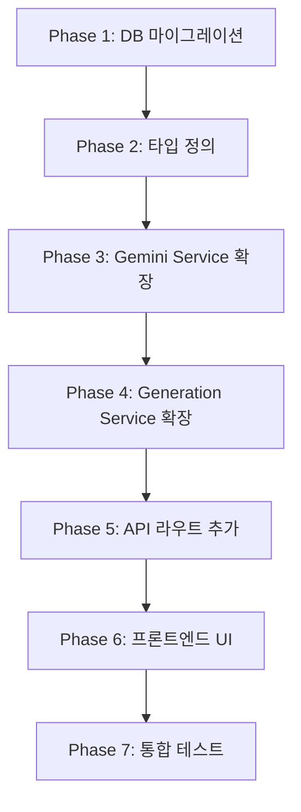

# PRD V2 (Product Requirements Document)
# AI 목업 이미지 프로그램 - 피드백 기반 기능 개선

## 문서 정보

| 항목 | 내용 |
|------|------|
| 문서 버전 | 2.0 |
| 작성일 | 2026-01-20 |
| 상태 | Draft |
| 기반 문서 | PRD v1.0, V2_req.md |

---

## 1. 개요

### 1.1 배경
V1 출시 후 디자이너 피드백을 기반으로 5가지 핵심 기능 개선이 필요함을 확인하였습니다. 본 문서는 해당 요구사항에 대한 상세 명세와 기술적 구현 방안을 정의합니다.

### 1.2 목표
- 재생성 시 입력값 유지로 사용자 편의성 향상
- 생성 결과의 일관성 강화 (배경/시점/그림자 고정)
- 스타일 복사 기능으로 디자인 일관성 보장
- 부자재(하드웨어) 디테일 보존
- IP 변경 시 추가 지시사항 입력 지원

### 1.3 API 검증 요약

| 요구사항 | Gemini API 기능 | 검증 상태 |
|---------|----------------|----------|
| 재생성 로직 개선 | System Instruction, 상태 분리 관리 | ✅ 검증완료 |
| 생성 옵션 고정 | temperature, System Instruction | ✅ 검증완료 |
| 스타일 복사 | thoughtSignature (Gemini 3) | ✅ 검증완료 |
| 부자재 보존 | System Instruction + 프롬프트 제약 | ✅ 검증완료 |
| 텍스트 입력 | 동적 프롬프트 + Structured Output | ✅ 검증완료 |

---

## 2. 기능별 상세 명세

### 2.1 재생성(Re-generation) 로직 개선

#### 2.1.1 현재 문제
- "다시 생성" 클릭 시 모든 입력값이 초기화됨
- 사용자가 동일한 조건으로 다른 결과를 받으려면 이미지/옵션을 다시 입력해야 함

#### 2.1.2 해결 방안

**inputs와 outputs 분리 관리**

```typescript
// 생성 요청 시 저장되는 데이터 구조
interface GenerationState {
  // Inputs - 재생성 시 유지됨
  inputs: {
    sourceImagePath: string;
    characterImagePath: string;
    prompt: string;
    options: GenerationOptions;
  };
  
  // Outputs - 재생성 시 새로 생성됨
  outputs: {
    generatedImages: GeneratedImage[];
    thoughtSignature?: string;
  };
}
```

#### 2.1.3 API 근거 (Gemini Prompting Strategies)

> "클라이언트 측에서 inputs와 outputs를 독립적으로 관리하여, 다시 생성 시 동일한 inputs로 새로운 outputs를 생성할 수 있습니다."

#### 2.1.4 UI 변경 사항

| 구분 | 현재 | 개선 후 |
|------|------|---------|
| "다시 생성" 버튼 | IP 변경 페이지로 이동 (입력값 초기화) | 동일 inputs로 즉시 재생성 요청 |
| 결과 페이지 | 재생성 시 페이지 이탈 필요 | 결과 페이지 내에서 재생성 가능 |

**결과 페이지 버튼 변경**

```
[기존]
🔄 다시 생성 → IP 변경 페이지로 이동

[개선]
🔄 동일 조건 재생성 → 현재 inputs로 새 결과 생성
✏️ 조건 수정 후 생성 → IP 변경 페이지로 이동 (inputs 프리필)
```

#### 2.1.5 구현 요구사항

1. **API 변경**: `POST /api/generations/:id/regenerate` 엔드포인트 추가
2. **DB 변경**: 없음 (기존 `promptData` JSON 필드 활용)
3. **프론트엔드**: 결과 페이지에 재생성 로직 추가

---

### 2.2 생성 옵션 고정 (배경/시점/그림자)

#### 2.2.1 현재 문제
- 생성 시마다 배경색, 카메라 시점, 그림자가 다르게 적용됨
- 동일 조건에서도 일관성 없는 결과 발생

#### 2.2.2 해결 방안

**1. System Instruction에 제약조건 명시**

```typescript
const SYSTEM_INSTRUCTION_CONSTRAINTS = `
## 필수 제약조건 (CRITICAL CONSTRAINTS)

### 시점(Viewpoint) 고정
✓ MUST: 원본 이미지와 동일한 카메라 각도 유지
✗ MUST NOT: 제품의 촬영 각도 변경

### 배경(Background) 고정
✓ MUST: 순수 흰색 배경 (#ffffff) 생성
✗ MUST NOT: 그라데이션, 패턴, 환경 배경 추가

### 그림자(Shadow) 제거
✓ MUST: 모든 그림자 제거
✗ MUST NOT: 드롭 쉐도우, 소프트 쉐도우 적용
`;
```

**2. System Instruction 기반 일관성 제어 (temperature 변경 비권장)**

```typescript
// gemini.service.ts 설정
// ⚠️ Gemini 3 모델에서는 temperature를 기본값 1.0에서 변경하지 않음
// 일관성은 System Instruction으로 제어
const GENERATION_CONFIG = {
  // temperature는 설정하지 않음 (기본값 1.0 사용)
};
```

#### 2.2.3 API 근거 (Gemini API 공식 문서)

**System Instruction 활용**
```javascript
const response = await ai.models.generateContent({
  model: "gemini-3-pro-image-preview",
  contents: [...],
  config: {
    systemInstruction: SYSTEM_INSTRUCTION_CONSTRAINTS,
    // ⚠️ temperature 설정 생략 - 기본값 1.0 사용
  },
});
```

> "제약조건을 명확히 지정하면 모델이 해야 할 일과 하지 말아야 할 일을 정확히 이해합니다." - Prompting Strategies

**🚨 중요: Gemini 3 temperature 경고**
> "When using Gemini 3 models, we **strongly recommend keeping the temperature at its default value of 1.0**. Changing the temperature (setting it below 1.0) may lead to **unexpected behavior, such as looping or degraded performance**, particularly in complex mathematical or reasoning tasks." - Gemini API 공식 문서

→ **Gemini 3 모델에서는 temperature를 변경하지 않고, System Instruction을 통해 일관성을 제어합니다.**

#### 2.2.4 UI 변경 사항

| 옵션 | 설명 | 기본값 |
|------|------|--------|
| ☑️ 흰색 배경 고정 | 순수 흰색 배경으로 생성 | ON |
| ☑️ 시점 유지 | 원본과 동일한 카메라 각도 | ON |
| ☑️ 그림자 제거 | 모든 그림자 제거 | OFF |

#### 2.2.5 구현 요구사항

1. **Gemini Service 수정**: System Instruction 템플릿 추가, temperature 설정
2. **UI 추가**: IP 변경 페이지에 옵션 체크박스 3개 추가
3. **API 확장**: `options` 필드에 새 옵션 추가

---

### 2.3 스타일 복사 (Style Copy) 기능

#### 2.3.1 현재 문제
- IP 변경 시 이전 생성의 디자인 스타일(배치, 각도, 효과)이 유지되지 않음
- 동일 제품에서 캐릭터만 변경해도 전체 레이아웃이 달라짐
- 다른 제품에 동일 스타일 적용 불가

#### 2.3.2 해결 방안

**Gemini 3의 `thoughtSignature` 활용**

```typescript
// 초기 생성 후 thoughtSignature 저장
const response = await ai.models.generateContent({
  model: "gemini-3-pro-image-preview",
  contents: [...],
});

// 응답에서 signature 추출 및 저장
const signature = response.candidates?.[0]?.content?.parts?.[0]?.thoughtSignature;
await saveThoughtSignature(generationId, signature);
```

**스타일 복사 시 Chat 모드 + signature 포함 (권장 방식)**

```typescript
// ⚠️ 이미지 편집은 Chat 모드 사용 권장 (codegen_instructions.md)
// 이전 생성의 signature를 포함하여 대화형 편집 수행

// 1. Chat 인스턴스 생성
const chat = ai.chats.create({ model: 'gemini-3-pro-image-preview' });

// 2. 초기 대화 히스토리 설정 (signature 포함)
// Chat 모드에서는 내부적으로 히스토리가 관리됨
const response = await chat.sendMessage({
  message: [
    { inlineData: { mimeType: 'image/png', data: previousImageBase64 } },
    "캐릭터를 변경하되 동일한 스타일(배치, 각도, 효과) 유지"
  ]
});

// 또는 명시적으로 히스토리를 구성하는 경우:
const styleEditRequest = {
  contents: [
    {
      role: "user",
      parts: [{ text: "원본 디자인 생성 요청..." }]
    },
    {
      role: "model",
      parts: [
        { text: "...", thoughtSignature: savedSignature },
        { inlineData: { mimeType: "image/png", data: previousImageBase64 }, thoughtSignature: savedSignature }
      ]
    },
    {
      role: "user",
      parts: [{ text: "캐릭터를 변경하되 동일한 스타일(배치, 각도, 효과) 유지" }]
    }
  ]
};
```

#### 2.3.3 API 근거 (Gemini 3 문서)

> "이미지 생성 및 수정에서 thoughtSignature는 대화형 편집에 매우 중요합니다. 모델이 이전 턴의 구성과 논리를 이해할 수 있도록 signature를 반드시 포함해야 합니다."

**Signature 검증 규칙**
- 모든 signature는 대화 히스토리에 포함되어야 함
- 모델 응답의 첫 번째 파트와 모든 이미지 파트에 signature 존재
- 다른 모델에서 전환 시 bypass 문자열 사용: `"context_engineering_is_the_way_to_go"`

#### 2.3.4 사용 시나리오

**시나리오 A: 동일 제품, 캐릭터 변경**

```
1. 사용자가 "머그컵 + 브라운 캐릭터" 목업 생성
2. 결과가 마음에 듦 (배치, 각도 등 스타일)
3. "스타일 복사하여 IP 변경" 클릭
4. 새 캐릭터 "코니" 선택
5. 동일한 배치/각도/효과로 "머그컵 + 코니" 생성
```

**시나리오 B: 다른 제품에 스타일 적용**

```
1. 사용자가 "머그컵" 목업을 원하는 스타일로 생성
2. "이 스타일을 다른 제품에 적용" 선택
3. 새로운 제품 이미지 (텀블러) 업로드
4. 동일 스타일로 "텀블러" 목업 생성
```

#### 2.3.5 DB 스키마 변경

```prisma
model Generation {
  // ... 기존 필드
  
  // V2 추가 필드
  thoughtSignatures  Json?    @map("thought_signatures")  // 응답의 모든 signature 저장
  styleReferenceId   String?  @map("style_reference_id")  // 스타일 참조한 생성 ID
  
  styleReference     Generation?  @relation("StyleReference", fields: [styleReferenceId], references: [id])
  styleFollowers     Generation[] @relation("StyleReference")
}
```

#### 2.3.6 UI 변경 사항

**결과 페이지 버튼 추가**

```
[기존 버튼]
✏️ 부분 수정 | 📚 히스토리에 저장 | 🔄 다시 생성

[V2 추가]
🎨 스타일 복사하여 IP 변경
    └─ 동일 스타일로 다른 캐릭터 적용
    
📋 이 스타일을 다른 제품에 적용
    └─ 새 제품 이미지 업로드 → 동일 스타일 적용
```

#### 2.3.7 구현 요구사항

1. **DB 마이그레이션**: `thoughtSignatures`, `styleReferenceId` 컬럼 추가
2. **Gemini Service 확장**: signature 추출/저장/복원 로직
3. **API 추가**:
   - `POST /api/generations/:id/copy-style` - 스타일 복사하여 새 생성
   - `GET /api/generations/:id/signatures` - 저장된 signature 조회
4. **UI 추가**: 결과 페이지에 스타일 복사 버튼

---

### 2.4 부자재 디테일 보존 (Hardware Preservation)

#### 2.4.1 현재 문제
- IP 변경 시 지퍼, 고리, 버클 등 부자재의 색상/위치가 변경됨
- 금속 부자재가 다른 색으로 바뀌거나 위치가 이동함

#### 2.4.2 해결 방안

**1. System Instruction에 Hardware Locking Matrix 정의**

```typescript
const HARDWARE_PRESERVATION_INSTRUCTION = `
## 부자재 보존 규칙 (Hardware Preservation Matrix)

| 구성요소 | 동작 | 잠금 상태 |
|---------|------|----------|
| 지퍼 (Zipper) | 색상/위치/크기 유지 | 🔒 LOCKED |
| 금속 고리 (D-ring, O-ring) | 색상/위치 유지 | 🔒 LOCKED |
| 버클 (Buckle) | 형태/색상 유지 | 🔒 LOCKED |
| 가죽 패치 (Leather patch) | 위치/크기 유지 | 🔒 LOCKED |
| 원단 표면 (Fabric) | 텍스처 변경 가능 | 🔓 VARIABLE |
| 캐릭터 영역 | IP 교체 대상 | 🔓 VARIABLE |

### 필수 규칙
✗ MUST NOT: 부자재의 색상 변경
✗ MUST NOT: 부자재의 위치 이동
✗ MUST NOT: 부자재의 크기 변경
✗ MUST NOT: 부자재 제거 또는 추가
`;
```

**2. 사용자 지정 부자재 사양 (선택적)**

```typescript
interface HardwareSpec {
  // 사용자가 직접 입력하거나 자동 감지
  items: Array<{
    type: 'zipper' | 'ring' | 'buckle' | 'patch' | 'button' | 'other';
    material: string;      // 예: "gun metal", "nickel", "brass"
    color: string;         // 예: "silver", "gold", "black"
    position: string;      // 예: "top center", "left side"
    size?: string;         // 예: "YKK #5", "0.75 inch"
  }>;
}
```

#### 2.4.3 API 근거 (Prompting Strategies)

> "제약조건을 명확히 지정하면 모델이 해야 할 일과 하지 말아야 할 일을 정확히 이해합니다."

**프롬프트 구성 예시**

```typescript
const buildHardwareConstraints = (specs: HardwareSpec) => {
  let constraints = HARDWARE_PRESERVATION_INSTRUCTION;
  
  if (specs.items.length > 0) {
    constraints += `\n\n## 감지된 부자재 상세\n`;
    specs.items.forEach((item, i) => {
      constraints += `${i + 1}. ${item.type}: ${item.material} ${item.color}, ${item.position}\n`;
    });
    constraints += `\n위 부자재들은 반드시 원본 그대로 유지되어야 합니다.`;
  }
  
  return constraints;
};
```

#### 2.4.4 UI 변경 사항

**IP 변경 페이지 옵션 추가**

```
📦 생성 옵션
├── ☑️ 원본 구조 우선 유지
├── ☑️ 투명 배경 (누끼)
└── ☑️ 부자재 보존 (지퍼, 고리 등) ← V2 추가

[부자재 보존 옵션 선택 시 펼쳐지는 상세 설정]
┌─────────────────────────────────────────┐
│ 부자재 상세 (선택 입력)                    │
│                                         │
│ 지퍼: YKK #5, 건메탈 그레이, 상단 중앙     │
│ 고리: 니켈, 2개, 모서리에서 5cm           │
│                                         │
│ * 미입력 시 자동으로 부자재 보존 시도       │
└─────────────────────────────────────────┘
```

#### 2.4.5 구현 요구사항

1. **Gemini Service 수정**: Hardware Preservation 프롬프트 템플릿 추가
2. **API 확장**: `options.preserveHardware` 필드 추가
3. **UI 추가**: IP 변경 페이지에 부자재 보존 체크박스 및 상세 입력 필드

---

### 2.5 IP 변경 시 텍스트 프롬프트 입력

#### 2.5.1 현재 문제
- IP 변경 시 추가 지시사항을 입력할 수 없음
- "지퍼 색상 유지", "손잡이 길이 변경 금지" 등 세부 요청 불가

#### 2.5.2 해결 방안

**1. 추가 프롬프트 입력 필드 제공**

```typescript
interface IPChangeRequest {
  sourceImagePath: string;
  characterImagePath: string;
  
  // V2 추가: 사용자 추가 지시사항
  userInstructions?: string;
  
  options: {
    preserveStructure: boolean;
    transparentBackground: boolean;
    preserveHardware: boolean;      // V2 추가
    fixedBackground: boolean;        // V2 추가
    fixedViewpoint: boolean;         // V2 추가
    removeShadows: boolean;          // V2 추가
  };
}
```

**2. 사용자 입력을 HIGHEST 우선순위로 설정**

```typescript
const buildPromptWithUserInstructions = (userInstructions: string) => {
  return `
${BASE_SYSTEM_INSTRUCTION}

## 🚨 사용자 지정 규칙 (HIGHEST PRIORITY)
아래 규칙은 다른 모든 규칙보다 우선합니다. 반드시 준수하세요:

${userInstructions}

IMPORTANT: 위 규칙은 필수입니다. 절대 위반하지 마세요.
`;
};
```

#### 2.5.3 API 근거 (Prompting Strategies)

> "사용자의 입력에 따라 처리할 프롬프트를 선택할 수 있습니다."

**Structured Output으로 규칙 위반 검증** (선택적 구현)

```typescript
const validationSchema = {
  type: Type.OBJECT,
  properties: {
    followedRules: {
      type: Type.ARRAY,
      items: { type: Type.STRING },
      description: '준수한 사용자 규칙 목록',
    },
    violatedRules: {
      type: Type.ARRAY,
      items: { type: Type.STRING },
      description: '위반된 사용자 규칙 목록 (비어있어야 함)',
    },
    confidenceScore: {
      type: Type.NUMBER,
      description: '규칙 준수 확신도 (0-100)',
    },
  },
};
```

#### 2.5.4 UI 변경 사항

**IP 변경 페이지에 추가 프롬프트 필드 추가**

```
┌─────────────────────────────────────────────────────┐
│ Step 2: 옵션 설정                                    │
│                                                     │
│ ☑️ 원본 구조 우선 유지                               │
│ ☑️ 투명 배경 (누끼)                                  │
│ ☑️ 부자재 보존                                       │
│                                                     │
│ ─────────────────────────────────────────────────── │
│                                                     │
│ 📝 추가 지시사항 (선택)                              │
│ ┌─────────────────────────────────────────────────┐ │
│ │ 예: "지퍼는 원래 색 유지", "손잡이 길이 변경 금지"  │ │
│ │                                                 │ │
│ │                                                 │ │
│ └─────────────────────────────────────────────────┘ │
│                                                     │
│              [ 목업 생성하기 ]                       │
└─────────────────────────────────────────────────────┘
```

#### 2.5.5 프롬프트 예시

| 사용자 입력 | 적용되는 제약 |
|------------|--------------|
| "지퍼 색상 원래대로 유지" | 지퍼 색상 변경 금지 |
| "캐릭터 위치는 정중앙에" | 캐릭터 배치 위치 고정 |
| "그림자 살짝만 추가" | 소프트 쉐도우 적용 |
| "배경에 약간의 그라데이션" | 흰색 배경 대신 그라데이션 |

#### 2.5.6 구현 요구사항

1. **API 확장**: `userInstructions` 필드 추가 (최대 2000자)
2. **Gemini Service 수정**: 사용자 지시사항을 HIGHEST 우선순위로 프롬프트에 포함
3. **UI 추가**: IP 변경 페이지에 textarea 추가

---

## 3. 기술 구현 명세

### 3.1 Gemini Service 확장

#### 3.1.1 System Instruction 템플릿화

```typescript
// services/gemini.service.ts

interface PromptTemplates {
  base: string;
  constraints: string;
  hardwarePreservation: string;
  userInstructions: string;
}

const PROMPT_TEMPLATES: PromptTemplates = {
  base: `당신은 제품 목업 이미지 생성 전문가입니다...`,
  
  constraints: `
## 필수 제약조건
✓ MUST: 원본 시점 유지
✓ MUST: 순수 흰색 배경
✗ MUST NOT: 그림자 추가
  `,
  
  hardwarePreservation: `
## 부자재 보존 규칙
| 구성요소 | 동작 | 잠금 |
|---------|------|-----|
| 지퍼 | 유지 | 🔒 |
...
  `,
  
  userInstructions: `
## 🚨 사용자 지정 규칙 (HIGHEST PRIORITY)
{USER_INSTRUCTIONS}
  `,
};
```

#### 3.1.2 thoughtSignature 관리

```typescript
interface ThoughtSignatureData {
  textSignature?: string;
  imageSignatures: string[];
  createdAt: Date;
}

class GeminiService {
  // signature 추출
  extractSignatures(response: GenerateContentResponse): ThoughtSignatureData {
    const signatures: ThoughtSignatureData = {
      imageSignatures: [],
      createdAt: new Date(),
    };
    
    const parts = response.candidates?.[0]?.content?.parts || [];
    parts.forEach((part, index) => {
      if (part.thoughtSignature) {
        if (index === 0) {
          signatures.textSignature = part.thoughtSignature;
        }
        if (part.inlineData) {
          signatures.imageSignatures.push(part.thoughtSignature);
        }
      }
    });
    
    return signatures;
  }
  
  // 대화형 편집용 히스토리 구성
  buildConversationHistory(
    previousGeneration: Generation,
    previousImageBase64: string,
    newRequest: string
  ): Content[] {
    const signatures = previousGeneration.thoughtSignatures as ThoughtSignatureData;
    
    return [
      {
        role: "user",
        parts: [{ text: "원본 요청..." }]
      },
      {
        role: "model",
        parts: [
          { text: "생성 완료", thoughtSignature: signatures.textSignature },
          { 
            inlineData: { mimeType: "image/png", data: previousImageBase64 },
            thoughtSignature: signatures.imageSignatures[0]
          }
        ]
      },
      {
        role: "user",
        parts: [{ text: newRequest }]
      }
    ];
  }
}
```

#### 3.1.3 생성 모드별 설정 (temperature 미사용)

```typescript
// ⚠️ Gemini 3 모델에서는 temperature 변경을 권장하지 않음
// 일관성 제어는 System Instruction으로 수행

// 모드별 System Instruction 강도 설정
const GENERATION_CONFIGS = {
  // IP 변경: 구조 유지 강조
  ip_change: {
    systemInstruction: CONSTRAINT_LEVEL.STRICT,
    // temperature 설정 생략 (기본값 1.0)
  },
  
  // 스케치 실사화: 창의성 허용
  sketch_to_real: {
    systemInstruction: CONSTRAINT_LEVEL.MODERATE,
    // temperature 설정 생략 (기본값 1.0)
  },
  
  // 스타일 복사: 가장 엄격한 제약
  style_copy: {
    systemInstruction: CONSTRAINT_LEVEL.VERY_STRICT,
    // temperature 설정 생략 (기본값 1.0)
  },
};

// System Instruction 강도별 템플릿
const CONSTRAINT_LEVEL = {
  MODERATE: '권장사항으로 처리',      // "SHOULD" 사용
  STRICT: '필수사항으로 처리',        // "MUST" 사용
  VERY_STRICT: '절대 제약으로 처리',  // "MUST + 🚨 CRITICAL" 사용
};
```

### 3.2 DB 스키마 변경

```prisma
// prisma/schema.prisma

model Generation {
  id                String           @id @default(uuid())
  projectId         String           @map("project_id")
  ipCharacterId     String?          @map("ip_character_id")
  sourceImageId     String?          @map("source_image_id")
  mode              GenerationMode
  status            GenerationStatus @default(pending)
  promptData        Json             @map("prompt_data")
  options           Json             @default("{}")
  retryCount        Int              @default(0) @map("retry_count")
  errorMessage      String?          @map("error_message")
  createdAt         DateTime         @default(now()) @map("created_at")
  completedAt       DateTime?        @map("completed_at")
  
  // V2 추가 필드
  thoughtSignatures Json?            @map("thought_signatures")  // signature 데이터
  styleReferenceId  String?          @map("style_reference_id")  // 스타일 참조 ID
  userInstructions  String?          @map("user_instructions")   // 사용자 추가 지시사항

  // 관계
  project         Project          @relation(fields: [projectId], references: [id], onDelete: Cascade)
  ipCharacter     IPCharacter?     @relation(fields: [ipCharacterId], references: [id], onDelete: SetNull)
  sourceImage     GeneratedImage?  @relation("SourceImage", fields: [sourceImageId], references: [id], onDelete: SetNull)
  images          GeneratedImage[] @relation("GenerationImages")
  styleReference  Generation?      @relation("StyleReference", fields: [styleReferenceId], references: [id])
  styleFollowers  Generation[]     @relation("StyleReference")

  @@index([projectId, createdAt(sort: Desc)])
  @@index([status])
  @@index([ipCharacterId])
  @@index([styleReferenceId])
  @@map("generations")
}
```

### 3.3 API 변경

#### 3.3.1 생성 요청 확장

```typescript
// POST /api/generations 요청 body 확장
interface CreateGenerationRequest {
  projectId: string;
  mode: 'ip_change' | 'sketch_to_real';
  sourceImagePath?: string;
  characterId?: string;
  characterImagePath?: string;
  textureImagePath?: string;
  prompt?: string;
  
  // V2 추가
  userInstructions?: string;           // 사용자 추가 지시사항
  styleReferenceId?: string;           // 스타일 참조할 생성 ID
  
  options?: {
    preserveStructure?: boolean;
    transparentBackground?: boolean;
    outputCount?: number;
    
    // V2 추가
    preserveHardware?: boolean;        // 부자재 보존
    fixedBackground?: boolean;          // 흰색 배경 고정
    fixedViewpoint?: boolean;           // 시점 고정
    removeShadows?: boolean;            // 그림자 제거
    hardwareSpecs?: HardwareSpec;       // 부자재 상세 사양
  };
}
```

#### 3.3.2 새 엔드포인트

```
# 재생성 (동일 inputs)
POST /api/generations/:id/regenerate
→ 기존 generation의 inputs로 새 결과 생성

# 스타일 복사
POST /api/generations/:id/copy-style
Body: {
  characterImagePath?: string,  // 새 캐릭터 (IP 변경 시)
  sourceImagePath?: string,     // 새 제품 (다른 제품 적용 시)
}
→ 기존 generation의 스타일로 새 결과 생성

# Signature 조회
GET /api/generations/:id/signatures
→ 저장된 thoughtSignature 반환
```

### 3.4 UI 변경 상세

#### 3.4.1 IP 변경 페이지 (`/projects/:id/ip-change`)

```tsx
// 추가 상태
const [userInstructions, setUserInstructions] = useState('');
const [preserveHardware, setPreserveHardware] = useState(false);
const [fixedBackground, setFixedBackground] = useState(true);
const [fixedViewpoint, setFixedViewpoint] = useState(true);
const [removeShadows, setRemoveShadows] = useState(false);

// 옵션 UI 확장
<div className="space-y-3">
  <label className="flex items-center gap-3">
    <input type="checkbox" checked={preserveStructure} ... />
    <span>원본 구조 우선 유지</span>
  </label>
  
  <label className="flex items-center gap-3">
    <input type="checkbox" checked={transparentBg} ... />
    <span>투명 배경 (누끼)</span>
  </label>
  
  {/* V2 추가 옵션 */}
  <label className="flex items-center gap-3">
    <input type="checkbox" checked={preserveHardware} ... />
    <span>부자재 보존 (지퍼, 고리 등)</span>
  </label>
  
  <label className="flex items-center gap-3">
    <input type="checkbox" checked={fixedBackground} ... />
    <span>흰색 배경 고정</span>
  </label>
  
  <label className="flex items-center gap-3">
    <input type="checkbox" checked={fixedViewpoint} ... />
    <span>시점 유지</span>
  </label>
  
  <label className="flex items-center gap-3">
    <input type="checkbox" checked={removeShadows} ... />
    <span>그림자 제거</span>
  </label>
</div>

{/* 추가 지시사항 입력 */}
<div className="mt-6">
  <label className="block text-sm font-medium mb-2">
    📝 추가 지시사항 (선택)
  </label>
  <textarea
    value={userInstructions}
    onChange={(e) => setUserInstructions(e.target.value)}
    placeholder="예: 지퍼는 원래 색 유지, 손잡이 길이 변경 금지"
    maxLength={2000}
    className="w-full h-24 ..."
  />
</div>
```

#### 3.4.2 결과 페이지 (`/projects/:id/generations/:genId`)

```tsx
// 추가 버튼
<div className="space-y-2 pt-4">
  <Button variant="secondary" onClick={() => setShowEditModal(true)}>
    ✏️ 부분 수정
  </Button>
  
  {/* V2 추가: 스타일 복사 버튼 */}
  <Button variant="secondary" onClick={handleStyleCopy}>
    🎨 스타일 복사하여 IP 변경
  </Button>
  
  <Button variant="secondary" onClick={handleApplyStyleToNewProduct}>
    📋 이 스타일을 다른 제품에 적용
  </Button>
  
  <Button variant="secondary" onClick={handleSaveToHistory}>
    📚 히스토리에 저장
  </Button>
  
  {/* V2 변경: 재생성 버튼 분리 */}
  <Button variant="secondary" onClick={handleRegenerate}>
    🔄 동일 조건 재생성
  </Button>
  
  <Button variant="ghost" onClick={handleModifyAndRegenerate}>
    ✏️ 조건 수정 후 생성
  </Button>
</div>
```

---

## 4. 비기능 요구사항

### 4.1 성능

| 항목 | 요구사항 |
|------|----------|
| thoughtSignature 저장 | DB 쿼리 추가 시간 < 10ms |
| 스타일 복사 생성 | 일반 생성과 동일 (< 30s) |
| 재생성 | 새 생성 요청과 동일 (< 30s) |

### 4.2 보안

- `thoughtSignature`는 내부용으로만 사용
- 클라이언트에 signature 값 노출 최소화
- API 응답에서 signature 필드는 선택적 반환

### 4.3 호환성

- 기존 V1 생성 기록과 역호환성 유지
- `thoughtSignatures` 필드가 없는 기존 Generation도 정상 동작
- 스타일 복사 시 signature 없으면 일반 생성으로 fallback

---

## 5. 테스트 계획

### 5.1 기능별 E2E 테스트

#### 재생성 로직
| 시나리오 | 예상 결과 |
|---------|----------|
| 결과 페이지에서 "동일 조건 재생성" 클릭 | 동일 inputs로 새 결과 생성 |
| 재생성 후 원본 생성 기록 확인 | 원본 그대로 유지 |

#### 생성 옵션 고정
| 시나리오 | 예상 결과 |
|---------|----------|
| "흰색 배경 고정" 체크 후 생성 | 순수 흰색 배경 출력 |
| "시점 유지" 체크 후 생성 | 원본과 동일한 카메라 각도 |
| "그림자 제거" 체크 후 생성 | 그림자 없는 결과 |

#### 스타일 복사
| 시나리오 | 예상 결과 |
|---------|----------|
| "스타일 복사하여 IP 변경" 후 다른 캐릭터 선택 | 동일 배치/각도로 캐릭터만 변경 |
| "다른 제품에 스타일 적용" 후 새 제품 업로드 | 동일 스타일로 새 제품 목업 |

#### 부자재 보존
| 시나리오 | 예상 결과 |
|---------|----------|
| "부자재 보존" 체크 후 IP 변경 | 지퍼/고리 색상/위치 유지 |
| 부자재 상세 입력 후 생성 | 입력한 사양대로 부자재 유지 |

#### 텍스트 입력
| 시나리오 | 예상 결과 |
|---------|----------|
| "지퍼 색상 유지" 입력 후 생성 | 지퍼 색상 변경 없음 |
| 복합 지시사항 입력 | 모든 지시사항 반영 |

---

## 6. 우선순위 및 로드맵

### 6.1 구현 우선순위

| 순위 | 기능 | 복잡도 | 사용자 가치 |
|------|------|--------|------------|
| 1 | IP 변경 시 텍스트 입력 | 낮음 | 높음 |
| 2 | 생성 옵션 고정 | 중간 | 높음 |
| 3 | 재생성 로직 개선 | 중간 | 중간 |
| 4 | 부자재 보존 | 중간 | 높음 |
| 5 | 스타일 복사 | 높음 | 높음 |

### 6.2 단계별 배포

**Phase 1 (즉시 구현 가능)**
- 텍스트 입력 필드 추가
- 생성 옵션 체크박스 추가
- System Instruction 템플릿화

**Phase 2 (DB 변경 필요)**
- 재생성 로직 개선
- 부자재 보존 기능

**Phase 3 (복잡한 구현)**
- thoughtSignature 기반 스타일 복사
- 대화형 편집 지원

---

## 부록: 용어 정의

| 용어 | 정의 |
|------|------|
| thoughtSignature | Gemini 3의 대화형 편집을 위한 컨텍스트 식별자 |
| System Instruction | 모델의 전반적인 행동 규칙을 정의하는 프롬프트 |
| Hardware | 제품의 금속 부자재 (지퍼, 고리, 버클 등) |
| 스타일 복사 | 이전 생성 결과의 배치/각도/효과를 새 생성에 적용 |
| 재생성 | 동일한 입력값으로 새로운 결과를 생성 |

---

## 7. 코드베이스 변경 가이드

본 섹션은 현재 코드베이스를 분석하여 V2 기능 구현 시 변경이 필요한 파일과 구체적인 변경 사항을 명세합니다.

### 7.1 현재 코드베이스 분석

#### 현재 구현 상태

| 기능 | 현재 상태 | V2 변경 필요 |
|------|----------|-------------|
| IP 변경 생성 | `ai.models.generateContent` 사용 | Chat 모드로 전환 권장 |
| 부분 수정 | Chat 모드 사용 중 ✅ | 유지 |
| 재생성 | 해당 모드 페이지로 이동 (입력값 초기화) | `regenerate` 엔드포인트 추가 |
| 옵션 | `preserveStructure`, `transparentBackground` | 6개 옵션 추가 |
| DB 스키마 | V1 구조 | 3개 컬럼 추가 |

### 7.2 DB 마이그레이션

#### 7.2.1 Prisma 스키마 변경

**파일:** `apps/api/prisma/schema.prisma`

```prisma
model Generation {
  // ... 기존 필드 유지
  
  // ===== V2 추가 필드 =====
  thoughtSignatures Json?            @map("thought_signatures")  // signature 데이터
  styleReferenceId  String?          @map("style_reference_id")  // 스타일 참조 ID
  userInstructions  String?          @map("user_instructions")   // 사용자 추가 지시사항 (최대 2000자)

  // 스타일 참조 관계
  styleReference  Generation?      @relation("StyleReference", fields: [styleReferenceId], references: [id])
  styleFollowers  Generation[]     @relation("StyleReference")

  @@index([styleReferenceId])
}
```

**마이그레이션 명령:**
```bash
cd apps/api
npx prisma migrate dev --name add_v2_fields
```

### 7.3 API 서비스 변경

#### 7.3.1 Gemini Service 수정

**파일:** `apps/api/src/services/gemini.service.ts`

**변경 사항:**

1. **GenerationOptions 인터페이스 확장**
```typescript
interface GenerationOptions {
  preserveStructure: boolean;
  transparentBackground: boolean;
  prompt?: string;
  // V2 추가 옵션
  preserveHardware?: boolean;      // 부자재 보존
  fixedBackground?: boolean;        // 흰색 배경 고정
  fixedViewpoint?: boolean;         // 시점 고정
  removeShadows?: boolean;          // 그림자 제거
  userInstructions?: string;        // 사용자 추가 지시사항
}
```

2. **System Instruction 템플릿 추가**
```typescript
// V2: System Instruction 템플릿
private readonly CONSTRAINT_TEMPLATES = {
  viewpoint: `
## 시점(Viewpoint) 고정
✓ MUST: 원본 이미지와 동일한 카메라 각도 유지
✗ MUST NOT: 제품의 촬영 각도 변경
`,
  background: `
## 배경(Background) 고정
✓ MUST: 순수 흰색 배경 (#ffffff) 생성
✗ MUST NOT: 그라데이션, 패턴, 환경 배경 추가
`,
  shadow: `
## 그림자(Shadow) 제거
✓ MUST: 모든 그림자 제거
✗ MUST NOT: 드롭 쉐도우, 소프트 쉐도우 적용
`,
  hardware: `
## 부자재 보존 규칙
| 구성요소 | 잠금 상태 |
|---------|----------|
| 지퍼 (Zipper) | 🔒 LOCKED |
| 금속 고리 (D-ring, O-ring) | 🔒 LOCKED |
| 버클 (Buckle) | 🔒 LOCKED |
| 가죽 패치 (Leather patch) | 🔒 LOCKED |

✗ MUST NOT: 부자재의 색상/위치/크기 변경
`,
  userPriority: `
## 🚨 사용자 지정 규칙 (HIGHEST PRIORITY)
아래 규칙은 다른 모든 규칙보다 우선합니다. 반드시 준수하세요:

{USER_INSTRUCTIONS}

IMPORTANT: 위 규칙은 필수입니다. 절대 위반하지 마세요.
`,
};
```

3. **thoughtSignature 추출 메서드 추가**
```typescript
/**
 * 응답에서 thoughtSignature 추출
 */
extractSignatures(response: any): ThoughtSignatureData {
  const signatures: ThoughtSignatureData = {
    imageSignatures: [],
    createdAt: new Date(),
  };
  
  const parts = response.candidates?.[0]?.content?.parts || [];
  parts.forEach((part: any, index: number) => {
    if (part.thoughtSignature) {
      if (index === 0) {
        signatures.textSignature = part.thoughtSignature;
      }
      if (part.inlineData) {
        signatures.imageSignatures.push(part.thoughtSignature);
      }
    }
  });
  
  return signatures;
}
```

4. **IP 변경 프롬프트 빌더 확장**
```typescript
private buildIPChangePrompt(options: GenerationOptions): string {
  let prompt = `당신은 제품 목업 이미지 생성 전문가입니다...`;

  // V2: 옵션별 제약조건 추가
  if (options.fixedViewpoint) {
    prompt += this.CONSTRAINT_TEMPLATES.viewpoint;
  }
  if (options.fixedBackground) {
    prompt += this.CONSTRAINT_TEMPLATES.background;
  }
  if (options.removeShadows) {
    prompt += this.CONSTRAINT_TEMPLATES.shadow;
  }
  if (options.preserveHardware) {
    prompt += this.CONSTRAINT_TEMPLATES.hardware;
  }
  if (options.userInstructions) {
    prompt += this.CONSTRAINT_TEMPLATES.userPriority
      .replace('{USER_INSTRUCTIONS}', options.userInstructions);
  }

  return prompt;
}
```

5. **스타일 복사 생성 메서드 추가**
```typescript
/**
 * 스타일 복사하여 새 생성 (Chat 모드 사용)
 */
async generateWithStyleCopy(
  previousImageBase64: string,
  signatures: ThoughtSignatureData,
  newCharacterImageBase64: string,
  options: GenerationOptions
): Promise<{ images: Buffer[]; newSignatures: ThoughtSignatureData }> {
  const chat = this.ai.chats.create({ model: this.imageModel });
  
  // 대화 히스토리 구성 (signature 포함)
  // ... 구현
}
```

#### 7.3.2 Generation Service 수정

**파일:** `apps/api/src/services/generation.service.ts`

**변경 사항:**

1. **CreateGenerationInput 확장**
```typescript
interface CreateGenerationInput {
  // ... 기존 필드
  
  // V2 추가
  userInstructions?: string;
  styleReferenceId?: string;
  
  options?: {
    // ... 기존 옵션
    preserveHardware?: boolean;
    fixedBackground?: boolean;
    fixedViewpoint?: boolean;
    removeShadows?: boolean;
  };
}
```

2. **재생성 메서드 추가**
```typescript
/**
 * 동일 조건으로 재생성
 */
async regenerate(userId: string, generationId: string): Promise<Generation> {
  const original = await this.getById(userId, generationId);
  if (!original) {
    throw new Error('생성 기록을 찾을 수 없습니다');
  }

  // 원본의 inputs 추출
  const promptData = original.promptData as any;
  const options = original.options as any;

  // 새 생성 요청 (동일 inputs)
  return this.create(userId, {
    projectId: original.projectId,
    mode: original.mode,
    sourceImagePath: promptData.sourceImagePath,
    characterImagePath: promptData.characterImagePath,
    characterId: original.ipCharacterId || undefined,
    textureImagePath: promptData.textureImagePath,
    prompt: promptData.userPrompt,
    options,
  });
}
```

3. **스타일 복사 메서드 추가**
```typescript
/**
 * 스타일 복사하여 새 생성
 */
async copyStyle(
  userId: string,
  generationId: string,
  input: { characterImagePath?: string; sourceImagePath?: string }
): Promise<Generation> {
  // ... 구현
}
```

### 7.4 API 라우트 변경

#### 7.4.1 Generation Routes 수정

**파일:** `apps/api/src/routes/generation.routes.ts`

**변경 사항:**

1. **요청 스키마 확장**
```typescript
const CreateGenerationSchema = z.object({
  // ... 기존 필드
  
  // V2 추가
  userInstructions: z.string().max(2000).optional(),
  styleReferenceId: z.string().uuid().optional(),
  
  options: z.object({
    // ... 기존 옵션
    preserveHardware: z.boolean().optional(),
    fixedBackground: z.boolean().optional(),
    fixedViewpoint: z.boolean().optional(),
    removeShadows: z.boolean().optional(),
  }).optional(),
});
```

2. **재생성 엔드포인트 추가**
```typescript
/**
 * 동일 조건 재생성
 * POST /api/generations/:id/regenerate
 */
fastify.post('/:id/regenerate', async (request, reply) => {
  const user = (request as any).user;
  const { id } = request.params as { id: string };

  try {
    const generation = await generationService.regenerate(user.id, id);
    return reply.code(201).send({
      success: true,
      data: { id: generation.id, status: generation.status },
    });
  } catch (error) {
    // ... 에러 처리
  }
});
```

3. **스타일 복사 엔드포인트 추가**
```typescript
/**
 * 스타일 복사
 * POST /api/generations/:id/copy-style
 */
fastify.post('/:id/copy-style', async (request, reply) => {
  // ... 구현
});
```

4. **Signature 조회 엔드포인트 추가**
```typescript
/**
 * Signature 조회
 * GET /api/generations/:id/signatures
 */
fastify.get('/:id/signatures', async (request, reply) => {
  // ... 구현
});
```

### 7.5 프론트엔드 변경

#### 7.5.1 IP 변경 페이지 수정

**파일:** `apps/web/src/app/projects/[id]/ip-change/page.tsx`

**변경 사항:**

1. **상태 추가**
```tsx
// V2 추가 상태
const [preserveHardware, setPreserveHardware] = useState(false);
const [fixedBackground, setFixedBackground] = useState(true);  // 기본값 ON
const [fixedViewpoint, setFixedViewpoint] = useState(true);    // 기본값 ON
const [removeShadows, setRemoveShadows] = useState(false);
const [userInstructions, setUserInstructions] = useState('');
```

2. **옵션 UI 확장** (현재 189-215 라인 영역)
```tsx
{/* V2 추가 옵션 */}
<label className="flex items-center gap-3">
  <input
    type="checkbox"
    checked={preserveHardware}
    onChange={(e) => setPreserveHardware(e.target.checked)}
    className="h-4 w-4 rounded border-[var(--border-default)] bg-[var(--bg-tertiary)]"
  />
  <span className="text-sm text-[var(--text-secondary)]">
    부자재 보존 (지퍼, 고리 등)
  </span>
</label>

{/* 추가 지시사항 입력 */}
<div className="mt-6">
  <label className="block text-sm font-medium mb-2 text-[var(--text-primary)]">
    📝 추가 지시사항 (선택)
  </label>
  <textarea
    value={userInstructions}
    onChange={(e) => setUserInstructions(e.target.value)}
    placeholder="예: 지퍼는 원래 색 유지, 손잡이 길이 변경 금지"
    maxLength={2000}
    className="w-full h-24 rounded-lg border border-[var(--border-default)] bg-[var(--bg-tertiary)] p-3 text-sm"
  />
</div>
```

3. **생성 요청 body 확장** (현재 87-97 라인 영역)
```tsx
body: JSON.stringify({
  // ... 기존 필드
  userInstructions: userInstructions || undefined,
  options: {
    preserveStructure,
    transparentBackground: transparentBg,
    outputCount: 2,
    // V2 추가
    preserveHardware,
    fixedBackground,
    fixedViewpoint,
    removeShadows,
  },
}),
```

#### 7.5.2 결과 페이지 수정

**파일:** `apps/web/src/app/projects/[id]/generations/[genId]/page.tsx`

**변경 사항:**

1. **재생성 핸들러 분리** (현재 201-210 라인)
```tsx
/**
 * 동일 조건 재생성 (V2)
 */
const handleRegenerateWithSameInputs = async () => {
  if (!accessToken) return;
  
  try {
    const response = await fetch(`${API_URL}/api/generations/${genId}/regenerate`, {
      method: 'POST',
      headers: {
        Authorization: `Bearer ${accessToken}`,
      },
    });
    
    const data = await response.json();
    if (data.success) {
      router.push(`/projects/${projectId}/generations/${data.data.id}`);
    }
  } catch (error) {
    console.error('재생성 실패:', error);
  }
};

/**
 * 조건 수정 후 생성 (기존 동작)
 */
const handleModifyAndRegenerate = () => {
  if (generation?.mode === 'ip_change') {
    router.push(`/projects/${projectId}/ip-change`);
  } else if (generation?.mode === 'sketch_to_real') {
    router.push(`/projects/${projectId}/sketch-to-real`);
  }
};
```

2. **스타일 복사 핸들러 추가**
```tsx
/**
 * 스타일 복사하여 IP 변경 (V2)
 */
const handleStyleCopy = () => {
  // 스타일 참조 ID를 쿼리 파라미터로 전달
  router.push(`/projects/${projectId}/ip-change?styleRef=${genId}`);
};

/**
 * 다른 제품에 스타일 적용 (V2)
 */
const handleApplyStyleToNewProduct = () => {
  // 모달 또는 새 페이지에서 제품 업로드 후 스타일 적용
  // ... 구현
};
```

3. **버튼 UI 변경** (현재 324-342 라인)
```tsx
<div className="space-y-2 pt-4">
  <Button variant="secondary" className="w-full" onClick={() => setShowEditModal(true)}>
    ✏️ 부분 수정
  </Button>
  
  {/* V2 추가: 스타일 복사 */}
  <Button variant="secondary" className="w-full" onClick={handleStyleCopy}>
    🎨 스타일 복사하여 IP 변경
  </Button>
  
  <Button variant="secondary" className="w-full" onClick={handleApplyStyleToNewProduct}>
    📋 다른 제품에 스타일 적용
  </Button>
  
  <Button variant="secondary" className="w-full" onClick={handleSaveToHistory} isLoading={isSaving}>
    📚 히스토리에 저장
  </Button>
  
  {/* V2 변경: 재생성 버튼 분리 */}
  <Button variant="secondary" className="w-full" onClick={handleRegenerateWithSameInputs}>
    🔄 동일 조건 재생성
  </Button>
  
  <Button variant="ghost" className="w-full" onClick={handleModifyAndRegenerate}>
    ✏️ 조건 수정 후 생성
  </Button>
</div>
```

### 7.6 공유 타입 변경

**파일:** `packages/shared/src/types/index.ts`

**변경 사항:**

```typescript
// V2 추가 옵션 스키마
export const GenerationOptionsSchema = z.object({
  preserveStructure: z.boolean().default(false),
  transparentBackground: z.boolean().default(false),
  outputCount: z.number().int().min(1).max(4).default(2),
  // V2 추가
  preserveHardware: z.boolean().default(false),
  fixedBackground: z.boolean().default(true),
  fixedViewpoint: z.boolean().default(true),
  removeShadows: z.boolean().default(false),
});

// V2 추가 타입
export interface ThoughtSignatureData {
  textSignature?: string;
  imageSignatures: string[];
  createdAt: Date;
}

export interface HardwareSpec {
  items: Array<{
    type: 'zipper' | 'ring' | 'buckle' | 'patch' | 'button' | 'other';
    material: string;
    color: string;
    position: string;
    size?: string;
  }>;
}
```

### 7.7 구현 순서 권장



| Phase | 작업 | 예상 시간 |
|-------|------|----------|
| 1 | DB 마이그레이션 | 30분 |
| 2 | 공유 타입 정의 | 30분 |
| 3 | Gemini Service 확장 | 2시간 |
| 4 | Generation Service 확장 | 1시간 |
| 5 | API 라우트 추가 | 1시간 |
| 6 | 프론트엔드 UI | 2시간 |
| 7 | 통합 테스트 | 1시간 |

---

## 참조 문서

- [Gemini API 공식 문서](https://ai.google.dev/gemini-api/docs)
- [Gemini 3 Guide - thoughtSignature](https://ai.google.dev/gemini-api/docs/gemini-3)
- [Prompting Strategies](https://ai.google.dev/gemini-api/docs/prompting-strategies)
- [@google/genai SDK 문서](https://googleapis.github.io/js-genai/)
