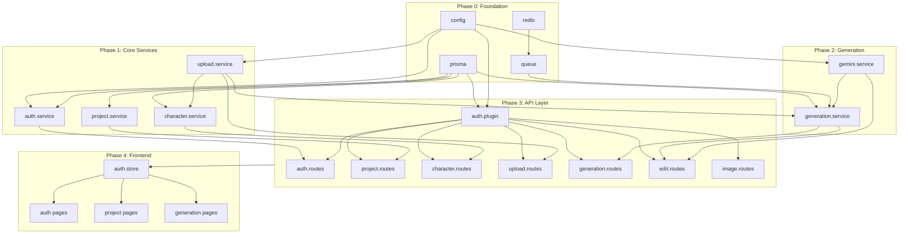
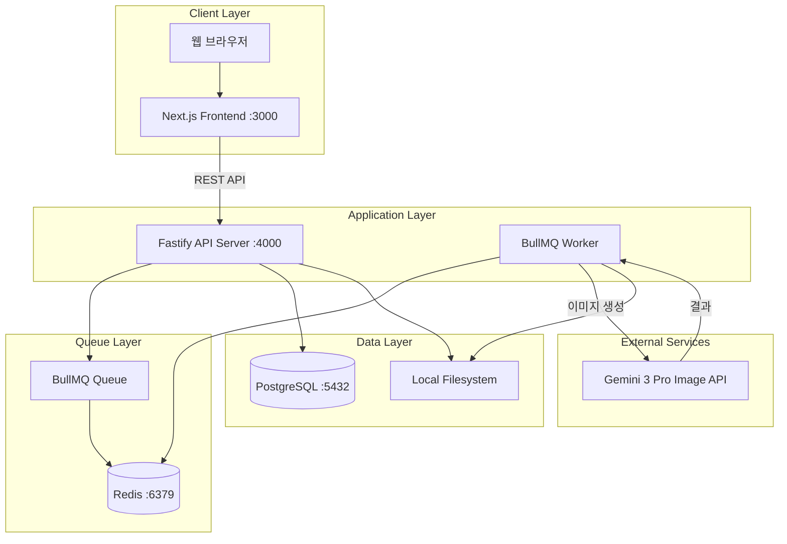
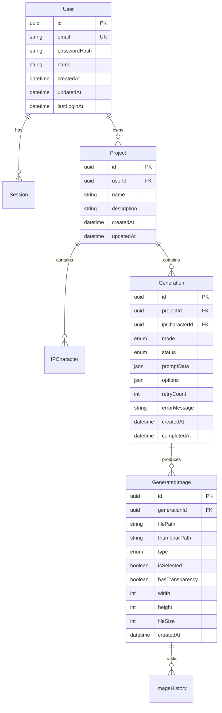

<rpg-method>
# AI 목업 이미지 프로그램 - PRD (RPG Method)

이 문서는 Microsoft Research의 Repository Planning Graph (RPG) 방법론을 적용하여 작성되었습니다.
기능적 분해(Functional)와 구조적 분해(Structural)를 분리하고, 명시적 의존성 그래프를 통해 개발 순서를 정의합니다.

## 문서 정보

| 항목 | 내용 |
|------|------|
| 문서 버전 | 2.0 (RPG Format) |
| 작성일 | 2026-01-22 |
| 상태 | Active |
| 기반 코드베이스 | 현재 구현 상태 반영 |

</rpg-method>

---

<overview>

## Problem Statement

제품 기획 초기단계에서 디자이너와 기획자는 실제 제품과 유사한 비주얼 목업을 빠르게 생성해야 하는 니즈가 있습니다.

**현재 문제점:**
- 3D 목업 제작에 많은 시간과 전문 인력이 소요됨
- 캐릭터 IP를 변경할 때마다 처음부터 재작업 필요
- 2D 스케치를 실사 제품으로 변환하는 과정이 복잡함
- 디자이너 리소스 대기 시간으로 의사결정 지연

**해결책:**
AI 기반 목업 생성 도구를 통해 캐릭터 IP 변경 및 스케치 실사화를 자동화하여,
디자이너와 기획자의 커뮤니케이션 효율을 극대화합니다.

## Target Users

### 주요 사용자: 제품 디자이너

| 항목 | 내용 |
|------|------|
| 역할 | 캐릭터 IP 기반 상품 디자인 담당 |
| 목표 | 빠르게 다양한 제품 목업을 생성하여 의사결정 시간 단축 |
| 페인포인트 | 3D 목업 제작에 많은 시간 소요, 수정 시 재작업 부담 |
| 기대효과 | 아이디어 검증 시간 90% 단축 |

### 보조 사용자: 기획자/마케터

| 항목 | 내용 |
|------|------|
| 역할 | 제품 기획 및 마케팅 전략 수립 |
| 목표 | 제품 컨셉을 시각적으로 빠르게 확인 |
| 페인포인트 | 디자이너 리소스 대기 시간 |
| 기대효과 | 즉각적인 비주얼 확인으로 의사결정 가속화 |

## Success Metrics

| 지표 | 목표 | 측정 방법 |
|------|------|-----------|
| 목업 생성 시간 | < 30초 (2장 기준) | API 응답 시간 로그 |
| 생성 성공률 | > 95% | 완료/실패 비율 |
| 사용자 선택률 | > 80% | 2장 중 1장 이상 선택 비율 |
| 동시 사용자 지원 | 5~20명 | 시스템 부하 테스트 |

</overview>

---

<functional-decomposition>

## Capability Tree

현재 시스템이 제공하는 기능(Capability)과 세부 기능(Feature)입니다.

### Capability: 사용자 인증 (Authentication)

사용자 계정 관리 및 세션 기반 인증을 제공합니다.

#### Feature: 회원가입
- **Description**: 이메일/비밀번호로 새 계정을 생성합니다.
- **Inputs**: 이메일, 비밀번호, 이름
- **Outputs**: 생성된 사용자 정보, Access Token
- **Behavior**: 이메일 중복 검사 후 비밀번호 해싱(bcrypt), DB 저장, JWT 발급

#### Feature: 로그인
- **Description**: 기존 계정으로 인증하여 세션을 시작합니다.
- **Inputs**: 이메일, 비밀번호
- **Outputs**: Access Token, 사용자 정보
- **Behavior**: 비밀번호 검증 후 JWT 토큰 발급, Session 테이블에 기록

#### Feature: 로그아웃
- **Description**: 현재 세션을 종료합니다.
- **Inputs**: Access Token
- **Outputs**: 성공 여부
- **Behavior**: Session 테이블에서 토큰 삭제

#### Feature: 현재 사용자 조회
- **Description**: 로그인된 사용자 정보를 반환합니다.
- **Inputs**: Access Token (Header)
- **Outputs**: 사용자 정보 (id, email, name)
- **Behavior**: JWT 검증 후 사용자 데이터 조회

---

### Capability: 프로젝트 관리 (Project Management)

목업 생성 작업을 프로젝트 단위로 관리합니다.

#### Feature: 프로젝트 생성
- **Description**: 새 프로젝트를 생성합니다.
- **Inputs**: 프로젝트명, 설명(선택)
- **Outputs**: 생성된 프로젝트 정보
- **Behavior**: 사용자 ID와 연결하여 Project 테이블에 저장

#### Feature: 프로젝트 목록 조회
- **Description**: 사용자의 모든 프로젝트를 조회합니다.
- **Inputs**: Access Token
- **Outputs**: 프로젝트 목록 (페이지네이션)
- **Behavior**: userId로 필터링, 최신순 정렬

#### Feature: 프로젝트 상세 조회
- **Description**: 특정 프로젝트의 상세 정보를 조회합니다.
- **Inputs**: 프로젝트 ID
- **Outputs**: 프로젝트 정보, 생성 기록 수, 캐릭터 목록
- **Behavior**: 소유권 검증 후 연관 데이터 포함 조회

#### Feature: 프로젝트 수정
- **Description**: 프로젝트 정보를 수정합니다.
- **Inputs**: 프로젝트 ID, 수정할 필드
- **Outputs**: 수정된 프로젝트 정보
- **Behavior**: 소유권 검증 후 부분 업데이트

#### Feature: 프로젝트 삭제
- **Description**: 프로젝트와 연관된 모든 데이터를 삭제합니다.
- **Inputs**: 프로젝트 ID
- **Outputs**: 성공 여부
- **Behavior**: Cascade 삭제 (생성 기록, 이미지 등)

---

### Capability: IP 캐릭터 관리 (Character Management)

프로젝트에서 사용할 캐릭터 IP를 관리합니다.

#### Feature: 캐릭터 등록
- **Description**: 프로젝트에 새 캐릭터 IP를 등록합니다.
- **Inputs**: 프로젝트 ID, 캐릭터명, 이미지 파일
- **Outputs**: 등록된 캐릭터 정보
- **Behavior**: 이미지 업로드 후 IPCharacter 테이블에 저장

#### Feature: 캐릭터 목록 조회
- **Description**: 프로젝트의 모든 캐릭터를 조회합니다.
- **Inputs**: 프로젝트 ID
- **Outputs**: 캐릭터 목록
- **Behavior**: projectId로 필터링

#### Feature: 캐릭터 삭제
- **Description**: 등록된 캐릭터를 삭제합니다.
- **Inputs**: 캐릭터 ID
- **Outputs**: 성공 여부
- **Behavior**: 파일 삭제 후 DB 레코드 삭제

---

### Capability: 목업 생성 (Mockup Generation)

AI를 활용한 제품 목업 이미지 생성의 핵심 기능입니다.

#### Feature: IP 변경 생성
- **Description**: 기존 제품 이미지에서 캐릭터 IP를 교체합니다.
- **Inputs**: 원본 제품 이미지, 새 캐릭터 이미지, 옵션(구조유지, 투명배경)
- **Outputs**: 생성된 목업 이미지 2장
- **Behavior**: 
  1. 이미지 업로드 및 저장
  2. Generation 레코드 생성 (status: pending)
  3. BullMQ 작업 큐에 추가
  4. Worker가 Gemini API 호출
  5. 결과 이미지 저장 및 상태 업데이트

#### Feature: 스케치 실사화 생성
- **Description**: 2D 스케치를 실제 제품 사진처럼 변환합니다.
- **Inputs**: 스케치 이미지, 질감 참조 이미지(선택), 추가 프롬프트(선택), 옵션
- **Outputs**: 생성된 목업 이미지 2장
- **Behavior**: IP 변경과 동일한 파이프라인, 다른 프롬프트 템플릿 사용

#### Feature: 부분 수정
- **Description**: 생성된 이미지에서 특정 부분만 수정합니다.
- **Inputs**: 원본 이미지 ID, 수정 요청 프롬프트
- **Outputs**: 수정된 이미지
- **Behavior**: 
  1. 선택된 이미지 로드
  2. Gemini Chat API로 편집 요청
  3. 새 Generation 레코드로 저장
  4. ImageHistory에 변경 이력 기록

#### Feature: 생성 상태 조회
- **Description**: 생성 작업의 현재 상태를 확인합니다.
- **Inputs**: 생성 ID
- **Outputs**: 상태(pending/processing/completed/failed), 이미지 목록
- **Behavior**: 2초 간격 폴링으로 상태 확인

---

### Capability: 이미지 관리 (Image Management)

생성된 이미지의 선택, 저장, 다운로드를 관리합니다.

#### Feature: 이미지 선택
- **Description**: 생성된 2장 중 1장을 선택합니다.
- **Inputs**: 생성 ID, 이미지 ID
- **Outputs**: 선택된 이미지 정보
- **Behavior**: 기존 선택 해제 후 새 이미지 선택 상태로 업데이트

#### Feature: 히스토리 조회
- **Description**: 프로젝트의 완료된 생성 기록을 조회합니다.
- **Inputs**: 프로젝트 ID, 페이지 번호
- **Outputs**: 생성 기록 목록 (선택된 이미지 포함)
- **Behavior**: status=completed 필터, 최신순 정렬, 페이지네이션

#### Feature: 이미지 다운로드
- **Description**: 생성된 이미지를 다운로드합니다.
- **Inputs**: 이미지 ID
- **Outputs**: 이미지 파일 (PNG)
- **Behavior**: 소유권 검증 후 파일 스트리밍

#### Feature: 히스토리에 저장
- **Description**: 선택한 이미지를 히스토리에 저장합니다.
- **Inputs**: 이미지 ID
- **Outputs**: 성공 여부
- **Behavior**: isSelected=true 설정, ImageHistory에 기록

#### Feature: 생성 기록 삭제
- **Description**: 생성 기록과 연관된 모든 이미지를 삭제합니다.
- **Inputs**: 생성 ID
- **Outputs**: 성공 여부
- **Behavior**: 파일 삭제 → ImageHistory 삭제 → GeneratedImage 삭제 → Generation 삭제

---

### Capability: 파일 업로드 (File Upload)

이미지 파일 업로드 및 저장을 처리합니다.

#### Feature: 이미지 업로드
- **Description**: 원본/스케치 이미지를 업로드합니다.
- **Inputs**: 이미지 파일, 프로젝트 ID
- **Outputs**: 저장된 파일 경로
- **Behavior**: 파일 유효성 검사 → UUID 파일명 생성 → 저장

#### Feature: 캐릭터 이미지 업로드
- **Description**: 캐릭터 IP 이미지를 업로드합니다.
- **Inputs**: 이미지 파일
- **Outputs**: 저장된 파일 경로
- **Behavior**: characters/ 디렉토리에 저장

</functional-decomposition>

---

<structural-decomposition>

## Repository Structure

현재 코드베이스의 구조와 각 모듈의 책임입니다.

```
icons-ai-mockup/
├── apps/
│   ├── api/                        # Backend API Server
│   │   ├── prisma/
│   │   │   ├── schema.prisma       # 데이터베이스 스키마
│   │   │   └── migrations/         # 마이그레이션 히스토리
│   │   └── src/
│   │       ├── config/
│   │       │   └── index.ts        # 환경 설정
│   │       ├── lib/
│   │       │   ├── prisma.ts       # Prisma 클라이언트
│   │       │   ├── redis.ts        # Redis 연결
│   │       │   └── queue.ts        # BullMQ 큐 설정
│   │       ├── plugins/
│   │       │   └── auth.plugin.ts  # JWT 인증 플러그인
│   │       ├── routes/
│   │       │   ├── auth.routes.ts       # 인증 API
│   │       │   ├── project.routes.ts    # 프로젝트 API
│   │       │   ├── character.routes.ts  # 캐릭터 API
│   │       │   ├── generation.routes.ts # 생성 API
│   │       │   ├── image.routes.ts      # 이미지 API
│   │       │   ├── upload.routes.ts     # 업로드 API
│   │       │   └── edit.routes.ts       # 부분 수정 API
│   │       ├── services/
│   │       │   ├── auth.service.ts      # 인증 로직
│   │       │   ├── project.service.ts   # 프로젝트 로직
│   │       │   ├── character.service.ts # 캐릭터 로직
│   │       │   ├── generation.service.ts # 생성 로직
│   │       │   ├── gemini.service.ts    # Gemini API 연동
│   │       │   └── upload.service.ts    # 파일 업로드 로직
│   │       ├── server.ts           # Fastify 서버 진입점
│   │       └── worker.ts           # BullMQ 워커
│   │
│   └── web/                        # Frontend Web App
│       └── src/
│           ├── app/
│           │   ├── (auth)/
│           │   │   ├── login/page.tsx     # 로그인 페이지
│           │   │   └── register/page.tsx  # 회원가입 페이지
│           │   ├── dashboard/page.tsx     # 대시보드
│           │   ├── projects/
│           │   │   ├── page.tsx           # 프로젝트 목록
│           │   │   └── [id]/
│           │   │       ├── page.tsx       # 프로젝트 상세
│           │   │       ├── ip-change/page.tsx      # IP 변경
│           │   │       ├── sketch-to-real/page.tsx # 스케치 실사화
│           │   │       ├── history/page.tsx        # 히스토리
│           │   │       └── generations/
│           │   │           └── [genId]/page.tsx    # 생성 결과
│           │   ├── layout.tsx             # 루트 레이아웃
│           │   └── globals.css            # 글로벌 스타일
│           ├── components/
│           │   ├── ui/
│           │   │   ├── button.tsx         # 버튼 컴포넌트
│           │   │   ├── input.tsx          # 입력 컴포넌트
│           │   │   └── image-uploader.tsx # 이미지 업로더
│           │   └── providers/
│           │       └── auth-provider.tsx  # 인증 프로바이더
│           ├── lib/
│           │   ├── api.ts                 # API 클라이언트
│           │   ├── cn.ts                  # 클래스명 유틸
│           │   └── utils.ts               # 유틸리티 함수
│           └── stores/
│               └── auth.store.ts          # Zustand 인증 스토어
│
├── packages/
│   └── shared/                     # 공유 패키지
│       └── src/
│           ├── types/index.ts      # 공통 타입 정의
│           ├── constants/index.ts  # 상수
│           └── utils/index.ts      # 유틸리티
│
├── docs/                           # 문서
│   ├── PRD.md                      # 원본 PRD
│   ├── prd_rpg.md                  # RPG 형식 PRD (현재 문서)
│   ├── TRD.md                      # 기술 요구사항
│   ├── ERD.md                      # 데이터베이스 설계
│   └── DESIGN_GUIDE.md             # 디자인 가이드
│
├── docker-compose.yml              # Docker 컨테이너 구성
├── turbo.json                      # Turborepo 설정
├── pnpm-workspace.yaml             # pnpm 워크스페이스
└── package.json                    # 루트 패키지
```

## Module Definitions

### Module: config
- **Maps to capability**: 모든 기능의 기반
- **Responsibility**: 환경 변수 관리 및 설정 검증
- **File structure**: `apps/api/src/config/index.ts`
- **Exports**:
  - `config` - 환경 설정 객체 (port, database, redis, jwt 등)

### Module: lib (Backend)
- **Maps to capability**: 데이터 접근 및 큐 관리
- **Responsibility**: 외부 서비스 연결 관리
- **File structure**:
  ```
  apps/api/src/lib/
  ├── prisma.ts   # Prisma 클라이언트 싱글톤
  ├── redis.ts    # Redis 연결
  └── queue.ts    # BullMQ 큐 설정 및 헬퍼
  ```
- **Exports**:
  - `prisma` - Prisma 클라이언트 인스턴스
  - `redis` - Redis 클라이언트 인스턴스
  - `addGenerationJob()` - 생성 작업 큐 추가

### Module: auth
- **Maps to capability**: 사용자 인증
- **Responsibility**: 회원가입, 로그인, JWT 관리
- **File structure**:
  ```
  apps/api/src/
  ├── plugins/auth.plugin.ts  # Fastify 인증 플러그인
  ├── routes/auth.routes.ts   # 인증 API 엔드포인트
  └── services/auth.service.ts # 인증 비즈니스 로직
  ```
- **Exports**:
  - `authPlugin` - Fastify 인증 훅
  - `authService` - 인증 서비스 클래스

### Module: project
- **Maps to capability**: 프로젝트 관리
- **Responsibility**: 프로젝트 CRUD
- **File structure**:
  ```
  apps/api/src/
  ├── routes/project.routes.ts
  └── services/project.service.ts
  ```
- **Exports**:
  - `projectService` - 프로젝트 서비스 클래스

### Module: character
- **Maps to capability**: IP 캐릭터 관리
- **Responsibility**: 캐릭터 등록 및 관리
- **File structure**:
  ```
  apps/api/src/
  ├── routes/character.routes.ts
  └── services/character.service.ts
  ```
- **Exports**:
  - `characterService` - 캐릭터 서비스 클래스

### Module: generation
- **Maps to capability**: 목업 생성
- **Responsibility**: AI 생성 요청 처리 및 상태 관리
- **File structure**:
  ```
  apps/api/src/
  ├── routes/generation.routes.ts
  ├── routes/edit.routes.ts
  └── services/generation.service.ts
  ```
- **Exports**:
  - `generationService` - 생성 서비스 클래스

### Module: gemini
- **Maps to capability**: 목업 생성 (AI 엔진)
- **Responsibility**: Gemini API 연동 및 프롬프트 관리
- **File structure**: `apps/api/src/services/gemini.service.ts`
- **Exports**:
  - `geminiService` - Gemini API 서비스 클래스
  - `generateIPChange()` - IP 변경 생성
  - `generateSketchToReal()` - 스케치 실사화
  - `generateEdit()` - 부분 수정

### Module: upload
- **Maps to capability**: 파일 업로드
- **Responsibility**: 이미지 파일 저장 및 관리
- **File structure**:
  ```
  apps/api/src/
  ├── routes/upload.routes.ts
  └── services/upload.service.ts
  ```
- **Exports**:
  - `uploadService` - 업로드 서비스 클래스

### Module: image
- **Maps to capability**: 이미지 관리
- **Responsibility**: 이미지 조회, 다운로드, 삭제
- **File structure**: `apps/api/src/routes/image.routes.ts`
- **Exports**: 라우트만 제공 (서비스는 generation에서 처리)

### Module: auth-store (Frontend)
- **Maps to capability**: 사용자 인증 (클라이언트)
- **Responsibility**: 인증 상태 관리
- **File structure**: `apps/web/src/stores/auth.store.ts`
- **Exports**:
  - `useAuthStore` - Zustand 스토어 훅

</structural-decomposition>

---

<dependency-graph>

## Dependency Chain

모듈 간 의존성을 Phase별로 정리합니다. 각 Phase는 이전 Phase가 완료된 후 구현 가능합니다.

### Foundation Layer (Phase 0)
기반 인프라로, 다른 모든 모듈이 의존합니다.

- **config**: 환경 변수 및 설정 관리
- **prisma**: 데이터베이스 연결 및 ORM
- **redis**: 캐시 및 큐 스토리지
- **queue**: BullMQ 작업 큐 설정

### Core Services Layer (Phase 1)
Foundation을 기반으로 핵심 비즈니스 로직을 구현합니다.

- **auth.service**: Depends on [prisma, config]
- **upload.service**: Depends on [config]
- **project.service**: Depends on [prisma]
- **character.service**: Depends on [prisma, upload.service]

### Generation Layer (Phase 2)
AI 생성 기능을 구현합니다.

- **gemini.service**: Depends on [config]
- **generation.service**: Depends on [prisma, queue, upload.service, gemini.service]

### API Layer (Phase 3)
HTTP API 엔드포인트를 구현합니다.

- **auth.plugin**: Depends on [prisma, config]
- **auth.routes**: Depends on [auth.service, auth.plugin]
- **project.routes**: Depends on [project.service, auth.plugin]
- **character.routes**: Depends on [character.service, auth.plugin]
- **upload.routes**: Depends on [upload.service, auth.plugin]
- **generation.routes**: Depends on [generation.service, auth.plugin]
- **edit.routes**: Depends on [generation.service, gemini.service, auth.plugin]
- **image.routes**: Depends on [prisma, auth.plugin]

### Frontend Layer (Phase 4)
사용자 인터페이스를 구현합니다.

- **auth.store**: Depends on [API Layer]
- **auth pages**: Depends on [auth.store]
- **project pages**: Depends on [auth.store, API Layer]
- **generation pages**: Depends on [auth.store, API Layer]

### Dependency Diagram



</dependency-graph>

---

<implementation-roadmap>

## Development Phases

### Phase 0: Foundation (완료)
**Goal**: 개발 환경 및 기반 인프라 구축

**Entry Criteria**: 프로젝트 초기화 완료

**Tasks**:
- [x] Monorepo 구조 설정 (pnpm workspace + Turborepo)
- [x] TypeScript 설정
- [x] Prisma 스키마 정의 및 마이그레이션
- [x] Redis/BullMQ 큐 설정
- [x] Docker Compose 구성
- [x] 환경 변수 관리

**Exit Criteria**: `docker compose up`으로 전체 스택 실행 가능

**Delivers**: 개발 환경 준비 완료

---

### Phase 1: Authentication & Project Management (완료)
**Goal**: 사용자 인증 및 프로젝트 관리 기능

**Entry Criteria**: Phase 0 완료

**Tasks**:
- [x] JWT 인증 플러그인 구현 (depends on: config, prisma)
- [x] 회원가입/로그인 API 구현 (depends on: auth.plugin)
- [x] 프로젝트 CRUD API 구현 (depends on: auth.plugin, prisma)
- [x] 프론트엔드 인증 페이지 구현
- [x] Zustand 인증 스토어 구현

**Exit Criteria**: 로그인 후 프로젝트 생성/조회 가능

**Delivers**: 사용자가 계정을 생성하고 프로젝트를 관리할 수 있음

---

### Phase 2: Mockup Generation Engine (완료)
**Goal**: AI 기반 목업 생성 핵심 기능

**Entry Criteria**: Phase 1 완료

**Tasks**:
- [x] Gemini API 서비스 구현 (depends on: config)
- [x] IP 변경 프롬프트 엔지니어링
- [x] 스케치 실사화 프롬프트 엔지니어링
- [x] 생성 서비스 구현 (depends on: prisma, queue, gemini.service)
- [x] BullMQ 워커 구현 (depends on: generation.service)
- [x] 부분 수정 기능 구현 (depends on: gemini.service)

**Exit Criteria**: API를 통해 목업 생성 및 수정 가능

**Delivers**: IP 변경, 스케치 실사화, 부분 수정 기능 동작

---

### Phase 3: Frontend UI (완료)
**Goal**: 사용자 인터페이스 구현

**Entry Criteria**: Phase 2 완료

**Tasks**:
- [x] 프로젝트 목록/상세 페이지
- [x] IP 변경 페이지 (이미지 업로드, 옵션 선택)
- [x] 스케치 실사화 페이지
- [x] 생성 결과 페이지 (이미지 선택, 다운로드)
- [x] 부분 수정 모달
- [x] 히스토리 페이지

**Exit Criteria**: 웹 UI를 통해 전체 워크플로우 실행 가능

**Delivers**: 완전한 사용자 경험

---

### Phase 4: Advanced Features (미완료)
**Goal**: 고급 기능 및 최적화

**Entry Criteria**: Phase 3 완료

**Tasks**:
- [ ] 2K 업스케일 다운로드 (Real-ESRGAN)
  - Acceptance criteria: 1K 이미지를 2K로 업스케일 후 다운로드
  - Test strategy: 업스케일 전후 해상도 비교
- [ ] 배치 생성 (여러 IP 동시 적용)
  - Acceptance criteria: 다수의 캐릭터 IP를 한 번에 적용
  - Test strategy: 병렬 처리 성능 테스트
- [ ] 결과물 비교 뷰
  - Acceptance criteria: 여러 생성 결과를 나란히 비교
  - Test strategy: UI 테스트
- [ ] 프롬프트 템플릿 저장/재사용
  - Acceptance criteria: 자주 쓰는 프롬프트 저장
  - Test strategy: CRUD 테스트

**Exit Criteria**: 고급 기능 모두 동작

**Delivers**: 생산성 향상 기능

</implementation-roadmap>

---

<test-strategy>

## Test Pyramid

```
        /\
       /E2E\       ← 10% (전체 워크플로우 테스트)
      /------\
     /Integration\ ← 30% (API 통합 테스트)
    /------------\
   /  Unit Tests  \ ← 60% (서비스 로직 테스트)
  /----------------\
```

## Coverage Requirements
- Line coverage: 80% 이상 (권장)
- Branch coverage: 70% 이상 (권장)
- 핵심 서비스 (auth, generation): 90% 이상

## Critical Test Scenarios

### Authentication Module
**Happy path**:
- 유효한 이메일/비밀번호로 회원가입 성공
- 등록된 계정으로 로그인 성공
- Expected: JWT 토큰 발급, 사용자 정보 반환

**Edge cases**:
- 중복 이메일로 회원가입 시도
- 비밀번호 8자 미만
- Expected: 적절한 에러 메시지 반환

**Error cases**:
- 잘못된 비밀번호로 로그인
- 만료된 토큰으로 API 호출
- Expected: 401 Unauthorized 응답

### Generation Module
**Happy path**:
- IP 변경: 원본 + 캐릭터 이미지로 2장 생성
- 스케치 실사화: 스케치 이미지로 2장 생성
- Expected: status=completed, 이미지 2장

**Edge cases**:
- 옵션 없이 생성 요청
- 질감 이미지 없이 스케치 실사화
- Expected: 기본값 적용 후 정상 생성

**Error cases**:
- Gemini API 실패
- 잘못된 이미지 형식
- Expected: status=failed, errorMessage 기록

### Image Management
**Happy path**:
- 2장 중 1장 선택
- 히스토리에 저장
- 이미지 다운로드
- Expected: 각 작업 성공

**Integration points**:
- 생성 완료 후 이미지 조회
- 히스토리 페이지에서 썸네일 표시
- Expected: 전체 플로우 정상 동작

## Test Generation Guidelines
- 각 서비스 클래스에 대한 단위 테스트 작성
- API 라우트에 대한 통합 테스트 작성
- Prisma는 테스트 DB 또는 Mock 사용
- Gemini API는 Mock 처리 권장

</test-strategy>

---

<architecture>

## System Components



## Data Models

### Core Entities



## Technology Stack

| 카테고리 | 기술 | 버전 | 용도 |
|----------|------|------|------|
| Frontend Framework | Next.js | 16.x | React 기반 풀스택 프레임워크 |
| UI Library | React | 19.x | UI 컴포넌트 |
| Styling | Tailwind CSS | 4.x | 유틸리티 기반 스타일링 |
| State Management | Zustand | 5.x | 클라이언트 상태 관리 |
| Backend Framework | Fastify | 5.x | 고성능 Node.js 서버 |
| ORM | Prisma | 7.x | 타입 안전 데이터베이스 ORM |
| Job Queue | BullMQ | 5.x | 비동기 작업 처리 |
| Database | PostgreSQL | 16.x | 관계형 데이터베이스 |
| Cache/Queue | Redis | 7.x | 캐싱 및 메시지 큐 |
| AI | Gemini 3 Pro Image | - | 이미지 생성 API |
| Language | TypeScript | 5.9.x | 타입 안전성 |
| Validation | Zod | 4.x | 스키마 기반 유효성 검사 |

**Decision: Fastify over Express**
- **Rationale**: 2~3배 빠른 성능, 스키마 기반 유효성 검사 내장, TypeScript 지원 우수
- **Trade-offs**: Express 생태계보다 플러그인 수 적음
- **Alternatives considered**: Express, Hono, Koa

**Decision: BullMQ for Job Queue**
- **Rationale**: Redis 기반으로 간단한 설정, 재시도/우선순위 지원, 실시간 상태 추적
- **Trade-offs**: Redis 의존성 필요
- **Alternatives considered**: Agenda, Bee-Queue

**Decision: Gemini 3 Pro Image API**
- **Rationale**: 고품질 이미지 생성, 멀티모달 입력 지원, 비용 효율적
- **Trade-offs**: API 레이트 리밋, 외부 서비스 의존
- **Alternatives considered**: Stable Diffusion, DALL-E 3

</architecture>

---

<risks>

## Technical Risks

### Risk: Gemini API 레이트 리밋
- **Impact**: High - 동시 사용자 증가 시 생성 지연/실패
- **Likelihood**: Medium
- **Mitigation**: 
  - BullMQ 레이트 리미터 설정 (분당 10요청)
  - 재시도 로직 (3회, 지수 백오프)
  - 사용자에게 대기 시간 표시
- **Fallback**: 다른 이미지 생성 API 대체 (Stable Diffusion API)

### Risk: 이미지 품질 불일치
- **Impact**: High - 사용자 기대와 다른 결과물
- **Likelihood**: Medium
- **Mitigation**:
  - 프롬프트 엔지니어링 최적화
  - 2장 생성하여 선택권 제공
  - 부분 수정 기능으로 보정
- **Fallback**: 수동 재생성 요청 기능

### Risk: 대용량 이미지 저장소 관리
- **Impact**: Medium - 디스크 공간 부족
- **Likelihood**: Medium
- **Mitigation**:
  - 정기적인 미사용 이미지 정리 스크립트
  - 썸네일 생성으로 미리보기 최적화
- **Fallback**: 클라우드 스토리지 마이그레이션 (S3)

## Dependency Risks

### Risk: Gemini API 서비스 중단
- **Impact**: Critical - 핵심 기능 사용 불가
- **Likelihood**: Low
- **Mitigation**: API 상태 모니터링, 장애 발생 시 사용자 알림
- **Fallback**: 로컬 Stable Diffusion 모델 대체

### Risk: Redis 장애
- **Impact**: High - 작업 큐 동작 불가
- **Likelihood**: Low
- **Mitigation**: Redis 헬스체크, 자동 재시작
- **Fallback**: 동기 처리 모드 (임시)

## Scope Risks

### Risk: 2K 업스케일 기능 미구현
- **Impact**: Medium - 고해상도 요구사항 미충족
- **Likelihood**: Confirmed (현재 미구현)
- **Mitigation**: Phase 4에서 Real-ESRGAN 통합 예정
- **Fallback**: 외부 업스케일 서비스 사용 안내

</risks>

---

<appendix>

## References
- [Gemini API Documentation](https://ai.google.dev/docs)
- [Fastify Documentation](https://fastify.dev/docs/latest/)
- [Prisma Documentation](https://www.prisma.io/docs)
- [BullMQ Documentation](https://docs.bullmq.io/)
- [Next.js Documentation](https://nextjs.org/docs)

## Glossary

| 용어 | 정의 |
|------|------|
| IP (Intellectual Property) | 캐릭터 지적재산권, 캐릭터 이미지/디자인을 의미 |
| 목업 (Mockup) | 실제 제품과 유사하게 제작된 시각적 모형 |
| 누끼 | 배경이 제거된 투명 배경 이미지 |
| 실사화 | 2D 이미지를 실제 제품처럼 3D 느낌으로 변환 |
| 기물 | 제품의 물리적 형태 (컵, 접시 등의 기본 구조) |
| BullMQ | Redis 기반 Node.js 작업 큐 라이브러리 |
| RPG | Repository Planning Graph - 의존성 기반 개발 계획 방법론 |

## Open Questions
1. 2K 업스케일 시 Real-ESRGAN 로컬 실행 vs 클라우드 API?
2. 팀 협업 기능 추가 시 권한 모델 설계?
3. 이미지 보관 정책 (무기한 vs 기간 제한)?

</appendix>

---

<task-master-integration>

# How Task Master Uses This PRD

이 PRD는 Task Master의 `parse-prd` 명령어와 호환됩니다.

## Parsing Guide

1. **Capability → Main Task**
   - 각 `### Capability:` 섹션이 최상위 태스크가 됩니다.

2. **Feature → Subtask**
   - 각 `#### Feature:` 섹션이 서브태스크가 됩니다.

3. **Dependencies → Task Dependencies**
   - Dependency Graph의 `Depends on: [X, Y]` 형식이 태스크 의존성이 됩니다.

4. **Phases → Priority**
   - Phase 0 = 최고 우선순위
   - Phase N = 낮은 우선순위

## Usage

```bash
# PRD 파싱하여 태스크 생성
task-master parse-prd docs/prd_rpg.md --research

# 태스크 확장
task-master expand --id 1

# 다음 태스크 확인
task-master next
```

</task-master-integration>
