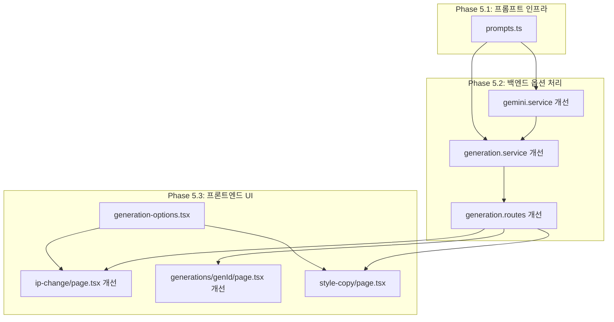
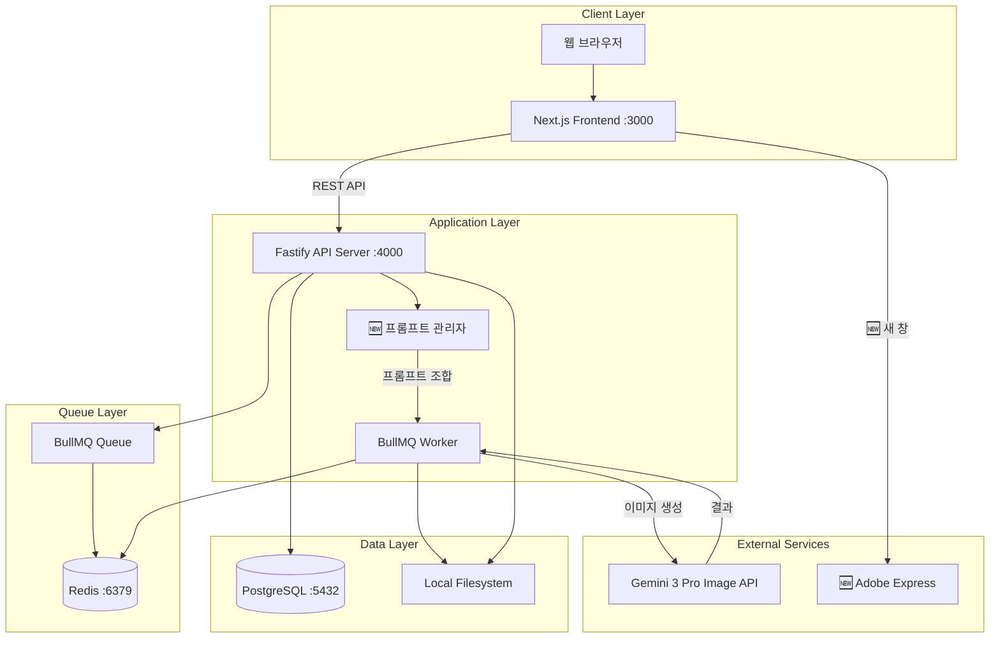
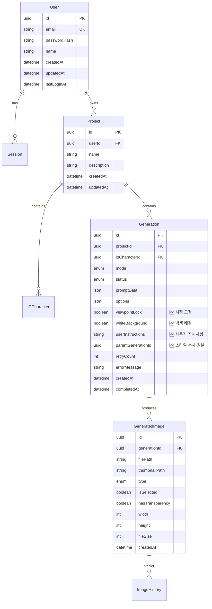

<rpg-method>
# AI 목업 이미지 프로그램 - PRD v3 (RPG Method)

이 문서는 Microsoft Research의 Repository Planning Graph (RPG) 방법론을 적용하여 작성되었습니다.
기능적 분해(Functional)와 구조적 분해(Structural)를 분리하고, 명시적 의존성 그래프를 통해 개발 순서를 정의합니다.

## 문서 정보

| 항목 | 내용 |
|------|------|
| 문서 버전 | 3.0 (RPG Format) |
| 작성일 | 2026-01-23 |
| 상태 | Active |
| 기반 문서 | prd_rpg.md (v2), feedback.pdf |
| 변경 사항 | 피드백 기반 5가지 기능 개선 추가 |

</rpg-method>

---

<overview>

## Problem Statement

제품 기획 초기단계에서 디자이너와 기획자는 실제 제품과 유사한 비주얼 목업을 빠르게 생성해야 하는 니즈가 있습니다.

**현재 문제점 (v2 피드백 기반):**
- 3D 목업 제작에 많은 시간과 전문 인력이 소요됨
- 캐릭터 IP를 변경할 때마다 처음부터 재작업 필요
- 2D 스케치를 실사 제품으로 변환하는 과정이 복잡함
- 디자이너 리소스 대기 시간으로 의사결정 지연

**v3에서 해결해야 할 추가 문제점:**
1. **재생성 시 초기화 문제**: '다시 생성' 버튼 클릭 시 기존 프롬프트와 이미지가 모두 초기화됨
2. **시점 변화 문제**: 이미지 생성 시 제품의 각도가 원본과 달라지는 현상
3. **투명 배경 불완전**: 현재 투명 배경 기능이 불완전하여 백색 배경으로 대체 필요
4. **스타일 불일관성**: 동일 제품에 캐릭터만 변경 시 질감, 부자재, 톤이 달라지는 문제
5. **부자재 디테일 변형**: 스케치 실사화 시 지퍼, 고리 등 부자재의 형상/색상이 임의 변경됨
6. **IP 변경 시 지시 불가**: 사용자가 변경하면 안 되는 디테일을 AI에게 명시적으로 전달할 방법 없음

**해결책:**
AI 기반 목업 생성 도구를 고도화하여, 프롬프트 엔지니어링과 UI 개선을 통해 
사용자 경험을 향상시키고 생성 품질의 일관성을 확보합니다.

## Target Users

### 주요 사용자: 제품 디자이너

| 항목 | 내용 |
|------|------|
| 역할 | 캐릭터 IP 기반 상품 디자인 담당 |
| 목표 | 빠르게 다양한 제품 목업을 생성하여 의사결정 시간 단축 |
| 페인포인트 | 3D 목업 제작에 많은 시간 소요, 수정 시 재작업 부담, 재생성 시 설정 초기화 |
| 기대효과 | 아이디어 검증 시간 90% 단축, 일관된 스타일 유지 |

### 보조 사용자: 기획자/마케터

| 항목 | 내용 |
|------|------|
| 역할 | 제품 기획 및 마케팅 전략 수립 |
| 목표 | 제품 컨셉을 시각적으로 빠르게 확인 |
| 페인포인트 | 디자이너 리소스 대기 시간 |
| 기대효과 | 즉각적인 비주얼 확인으로 의사결정 가속화 |

## Success Metrics

| 지표 | 목표 | 측정 방법 |
|------|------|-----------|
| 목업 생성 시간 | < 30초 (2장 기준) | API 응답 시간 로그 |
| 생성 성공률 | > 95% | 완료/실패 비율 |
| 사용자 선택률 | > 80% | 2장 중 1장 이상 선택 비율 |
| 재생성 사용률 | 측정 필요 | 다시 생성 버튼 클릭 수 |
| 스타일 복사 만족도 | > 85% | 사용자 피드백 |
| 동시 사용자 지원 | 5~20명 | 시스템 부하 테스트 |

</overview>

---

<functional-decomposition>

## Capability Tree

현재 시스템이 제공하는 기능(Capability)과 세부 기능(Feature)입니다.
**v3 신규 기능은 🆕로 표시합니다.**

### Capability: 사용자 인증 (Authentication)

사용자 계정 관리 및 세션 기반 인증을 제공합니다.

#### Feature: 회원가입
- **Description**: 이메일/비밀번호로 새 계정을 생성합니다.
- **Inputs**: 이메일, 비밀번호, 이름
- **Outputs**: 생성된 사용자 정보, Access Token
- **Behavior**: 이메일 중복 검사 후 비밀번호 해싱(bcrypt), DB 저장, JWT 발급

#### Feature: 로그인
- **Description**: 기존 계정으로 인증하여 세션을 시작합니다.
- **Inputs**: 이메일, 비밀번호
- **Outputs**: Access Token, 사용자 정보
- **Behavior**: 비밀번호 검증 후 JWT 토큰 발급, Session 테이블에 기록

#### Feature: 로그아웃
- **Description**: 현재 세션을 종료합니다.
- **Inputs**: Access Token
- **Outputs**: 성공 여부
- **Behavior**: Session 테이블에서 토큰 삭제

#### Feature: 현재 사용자 조회
- **Description**: 로그인된 사용자 정보를 반환합니다.
- **Inputs**: Access Token (Header)
- **Outputs**: 사용자 정보 (id, email, name)
- **Behavior**: JWT 검증 후 사용자 데이터 조회

---

### Capability: 프로젝트 관리 (Project Management)

목업 생성 작업을 프로젝트 단위로 관리합니다.

#### Feature: 프로젝트 생성
- **Description**: 새 프로젝트를 생성합니다.
- **Inputs**: 프로젝트명, 설명(선택)
- **Outputs**: 생성된 프로젝트 정보
- **Behavior**: 사용자 ID와 연결하여 Project 테이블에 저장

#### Feature: 프로젝트 목록 조회
- **Description**: 사용자의 모든 프로젝트를 조회합니다.
- **Inputs**: Access Token
- **Outputs**: 프로젝트 목록 (페이지네이션)
- **Behavior**: userId로 필터링, 최신순 정렬

#### Feature: 프로젝트 상세 조회
- **Description**: 특정 프로젝트의 상세 정보를 조회합니다.
- **Inputs**: 프로젝트 ID
- **Outputs**: 프로젝트 정보, 생성 기록 수, 캐릭터 목록
- **Behavior**: 소유권 검증 후 연관 데이터 포함 조회

#### Feature: 프로젝트 수정
- **Description**: 프로젝트 정보를 수정합니다.
- **Inputs**: 프로젝트 ID, 수정할 필드
- **Outputs**: 수정된 프로젝트 정보
- **Behavior**: 소유권 검증 후 부분 업데이트

#### Feature: 프로젝트 삭제
- **Description**: 프로젝트와 연관된 모든 데이터를 삭제합니다.
- **Inputs**: 프로젝트 ID
- **Outputs**: 성공 여부
- **Behavior**: Cascade 삭제 (생성 기록, 이미지 등)

---

### Capability: IP 캐릭터 관리 (Character Management)

프로젝트에서 사용할 캐릭터 IP를 관리합니다.

#### Feature: 캐릭터 등록
- **Description**: 프로젝트에 새 캐릭터 IP를 등록합니다.
- **Inputs**: 프로젝트 ID, 캐릭터명, 이미지 파일
- **Outputs**: 등록된 캐릭터 정보
- **Behavior**: 이미지 업로드 후 IPCharacter 테이블에 저장

#### Feature: 캐릭터 목록 조회
- **Description**: 프로젝트의 모든 캐릭터를 조회합니다.
- **Inputs**: 프로젝트 ID
- **Outputs**: 캐릭터 목록
- **Behavior**: projectId로 필터링

#### Feature: 캐릭터 삭제
- **Description**: 등록된 캐릭터를 삭제합니다.
- **Inputs**: 캐릭터 ID
- **Outputs**: 성공 여부
- **Behavior**: 파일 삭제 후 DB 레코드 삭제

---

### Capability: 목업 생성 (Mockup Generation)

AI를 활용한 제품 목업 이미지 생성의 핵심 기능입니다.

#### Feature: IP 변경 생성
- **Description**: 기존 제품 이미지에서 캐릭터 IP를 교체합니다.
- **Inputs**: 원본 제품 이미지, 새 캐릭터 이미지, 옵션(구조유지, 백색배경, 시점고정), 🆕 사용자 지시사항 텍스트
- **Outputs**: 생성된 목업 이미지 2장
- **Behavior**: 
  1. 이미지 업로드 및 저장
  2. Generation 레코드 생성 (status: pending)
  3. 🆕 사용자 지시사항을 프롬프트에 포함
  4. 🆕 시점 고정 옵션 적용 시 "Keep the same camera angle and perspective" 프롬프트 추가
  5. 🆕 백색 배경 옵션 적용 시 "Clean white background with no shadows" 프롬프트 추가
  6. BullMQ 작업 큐에 추가
  7. Worker가 Gemini API 호출
  8. 결과 이미지 저장 및 상태 업데이트

#### Feature: 스케치 실사화 생성
- **Description**: 2D 스케치를 실제 제품 사진처럼 변환합니다.
- **Inputs**: 스케치 이미지, 질감 참조 이미지(선택), 추가 프롬프트(선택), 옵션(시점고정, 백색배경)
- **Outputs**: 생성된 목업 이미지 2장
- **Behavior**: 
  1. IP 변경과 동일한 파이프라인
  2. 🆕 부자재 디테일 보존을 위한 Semantic Negative Prompt 적용
  3. 프롬프트에 "Keep all accessories (zippers, key rings, buttons) exactly as shown in the original with same colors and shapes" 추가

#### Feature: 🆕 스타일 복사 생성 (Style Copy)
- **Description**: 기존 생성 결과물의 스타일(질감, 부자재, 톤)을 유지하면서 캐릭터만 변경합니다.
- **Inputs**: 기존 결과물 이미지 (Generation ID), 새 캐릭터 이미지, 옵션
- **Outputs**: 생성된 목업 이미지 2장
- **Behavior**:
  1. 기존 Generation 레코드에서 선택된 이미지 로드
  2. IP 변경과 동일한 메커니즘 사용
  3. 프롬프트에 스타일 유지 지시어 추가:
     - "Maintain the exact same material texture, color tone, and accessory details from the reference image"
     - "Only change the character while preserving all other visual elements"
  4. Multi-turn Chat 또는 Reference Images 활용 (Gemini 3 Pro)

#### Feature: 부분 수정
- **Description**: 생성된 이미지에서 특정 부분만 수정합니다.
- **Inputs**: 원본 이미지 ID, 수정 요청 프롬프트
- **Outputs**: 수정된 이미지
- **Behavior**: 
  1. 선택된 이미지 로드
  2. Gemini Chat API로 편집 요청
  3. 새 Generation 레코드로 저장
  4. ImageHistory에 변경 이력 기록

#### Feature: 🆕 다시 생성 (Regenerate)
- **Description**: 기존 설정을 유지한 채 결과물만 새로 생성합니다.
- **Inputs**: 기존 Generation ID
- **Outputs**: 새로 생성된 목업 이미지 2장
- **Behavior**:
  1. 기존 Generation 레코드에서 모든 설정 복사 (프롬프트, 이미지, 옵션)
  2. 동일한 설정으로 새 Generation 생성
  3. 기존 프롬프트와 이미지는 초기화하지 않음
  4. 새 결과물만 생성하여 반환

#### Feature: 생성 상태 조회
- **Description**: 생성 작업의 현재 상태를 확인합니다.
- **Inputs**: 생성 ID
- **Outputs**: 상태(pending/processing/completed/failed), 이미지 목록
- **Behavior**: 2초 간격 폴링으로 상태 확인

---

### Capability: 생성 옵션 (Generation Options) 🆕

이미지 생성 시 적용할 수 있는 옵션들을 관리합니다.

#### Feature: 🆕 시점 고정 옵션 (Viewpoint Lock)
- **Description**: 원본 이미지의 카메라 앵글/시점을 유지합니다.
- **Inputs**: 체크박스 선택 여부
- **Outputs**: 프롬프트에 시점 고정 지시어 추가
- **Behavior**:
  1. 옵션 활성화 시 프롬프트에 다음 추가:
     - "Keep the exact same camera angle, perspective, and viewpoint as the original image"
     - "Do not change the product's orientation or angle"
  2. Gemini API의 카메라 제어 언어 활용

#### Feature: 🆕 백색 배경 옵션 (White Background)
- **Description**: 그림자 없는 완전한 백색 배경으로 결과물을 생성합니다.
- **Inputs**: 체크박스 선택 여부
- **Outputs**: 프롬프트에 백색 배경 지시어 추가
- **Behavior**:
  1. 기존 "투명 배경" 옵션을 대체
  2. 옵션 활성화 시 프롬프트에 다음 추가:
     - "The background must be pure white with no shadows"
     - "Clean, studio-lit product photograph on white background"
  3. 투명 배경이 필요한 경우 Adobe Express 링크 제공

#### Feature: 🆕 부자재 보존 옵션 (Accessory Preservation)
- **Description**: 스케치 실사화 시 부자재(지퍼, 키링 등)의 디테일을 보존합니다.
- **Inputs**: 스케치 실사화 모드에서 자동 적용 또는 수동 선택
- **Outputs**: Semantic Negative Prompt 적용
- **Behavior**:
  1. 프롬프트에 다음 추가:
     - "CRITICAL: Keep all accessories (zippers, key rings, buttons, buckles) exactly as shown in the original"
     - "Preserve the exact colors and shapes of all hardware and decorative elements"
     - "Do not modify, add, or remove any accessory details"
  2. 스케치 실사화 모드에서 기본 활성화

---

### Capability: 이미지 관리 (Image Management)

생성된 이미지의 선택, 저장, 다운로드를 관리합니다.

#### Feature: 이미지 선택
- **Description**: 생성된 2장 중 1장을 선택합니다.
- **Inputs**: 생성 ID, 이미지 ID
- **Outputs**: 선택된 이미지 정보
- **Behavior**: 기존 선택 해제 후 새 이미지 선택 상태로 업데이트

#### Feature: 히스토리 조회
- **Description**: 프로젝트의 완료된 생성 기록을 조회합니다.
- **Inputs**: 프로젝트 ID, 페이지 번호
- **Outputs**: 생성 기록 목록 (선택된 이미지 포함)
- **Behavior**: status=completed 필터, 최신순 정렬, 페이지네이션

#### Feature: 이미지 다운로드
- **Description**: 생성된 이미지를 다운로드합니다.
- **Inputs**: 이미지 ID
- **Outputs**: 이미지 파일 (PNG)
- **Behavior**: 소유권 검증 후 파일 스트리밍

#### Feature: 🆕 Adobe Express 누끼 링크
- **Description**: 투명 배경이 필요한 사용자를 위해 Adobe Express 배경 제거 페이지로 이동합니다.
- **Inputs**: 버튼 클릭
- **Outputs**: 새 창에서 Adobe Express 페이지 열기
- **Behavior**:
  1. 다운로드 버튼 옆에 "배경 제거 (Adobe)" 버튼 배치
  2. 클릭 시 `https://www.adobe.com/express/feature/image/remove-background` 새 창으로 열기

#### Feature: 히스토리에 저장
- **Description**: 선택한 이미지를 히스토리에 저장합니다.
- **Inputs**: 이미지 ID
- **Outputs**: 성공 여부
- **Behavior**: isSelected=true 설정, ImageHistory에 기록

#### Feature: 생성 기록 삭제
- **Description**: 생성 기록과 연관된 모든 이미지를 삭제합니다.
- **Inputs**: 생성 ID
- **Outputs**: 성공 여부
- **Behavior**: 파일 삭제 → ImageHistory 삭제 → GeneratedImage 삭제 → Generation 삭제

---

### Capability: 파일 업로드 (File Upload)

이미지 파일 업로드 및 저장을 처리합니다.

#### Feature: 이미지 업로드
- **Description**: 원본/스케치 이미지를 업로드합니다.
- **Inputs**: 이미지 파일, 프로젝트 ID
- **Outputs**: 저장된 파일 경로
- **Behavior**: 파일 유효성 검사 → UUID 파일명 생성 → 저장

#### Feature: 캐릭터 이미지 업로드
- **Description**: 캐릭터 IP 이미지를 업로드합니다.
- **Inputs**: 이미지 파일
- **Outputs**: 저장된 파일 경로
- **Behavior**: characters/ 디렉토리에 저장

</functional-decomposition>

---

<structural-decomposition>

## Repository Structure

현재 코드베이스의 구조와 각 모듈의 책임입니다.
**v3 신규/수정 파일은 🆕로 표시합니다.**

```
icons-ai-mockup/
├── apps/
│   ├── api/                        # Backend API Server
│   │   ├── prisma/
│   │   │   ├── schema.prisma       # 🆕 데이터베이스 스키마 (옵션 필드 추가)
│   │   │   └── migrations/         # 마이그레이션 히스토리
│   │   └── src/
│   │       ├── config/
│   │       │   └── index.ts        # 환경 설정
│   │       ├── lib/
│   │       │   ├── prisma.ts       # Prisma 클라이언트
│   │       │   ├── redis.ts        # Redis 연결
│   │       │   ├── queue.ts        # BullMQ 큐 설정
│   │       │   └── 🆕 prompts.ts   # 프롬프트 템플릿 관리
│   │       ├── plugins/
│   │       │   └── auth.plugin.ts  # JWT 인증 플러그인
│   │       ├── routes/
│   │       │   ├── auth.routes.ts       # 인증 API
│   │       │   ├── project.routes.ts    # 프로젝트 API
│   │       │   ├── character.routes.ts  # 캐릭터 API
│   │       │   ├── generation.routes.ts # 🆕 생성 API (다시 생성, 스타일 복사 추가)
│   │       │   ├── image.routes.ts      # 이미지 API
│   │       │   ├── upload.routes.ts     # 업로드 API
│   │       │   └── edit.routes.ts       # 부분 수정 API
│   │       ├── services/
│   │       │   ├── auth.service.ts      # 인증 로직
│   │       │   ├── project.service.ts   # 프로젝트 로직
│   │       │   ├── character.service.ts # 캐릭터 로직
│   │       │   ├── generation.service.ts # 🆕 생성 로직 (옵션 처리 추가)
│   │       │   ├── gemini.service.ts    # 🆕 Gemini API 연동 (프롬프트 개선)
│   │       │   └── upload.service.ts    # 파일 업로드 로직
│   │       ├── server.ts           # Fastify 서버 진입점
│   │       └── worker.ts           # BullMQ 워커
│   │
│   └── web/                        # Frontend Web App
│       └── src/
│           ├── app/
│           │   ├── (auth)/
│           │   │   ├── login/page.tsx     # 로그인 페이지
│           │   │   └── register/page.tsx  # 회원가입 페이지
│           │   ├── dashboard/page.tsx     # 대시보드
│           │   ├── projects/
│           │   │   ├── page.tsx           # 프로젝트 목록
│           │   │   └── [id]/
│           │   │       ├── page.tsx       # 프로젝트 상세
│           │   │       ├── ip-change/page.tsx      # 🆕 IP 변경 (텍스트 입력 추가)
│           │   │       ├── sketch-to-real/page.tsx # 스케치 실사화
│           │   │       ├── 🆕 style-copy/page.tsx  # 스타일 복사 페이지
│           │   │       ├── history/page.tsx        # 히스토리
│           │   │       └── generations/
│           │   │           └── [genId]/page.tsx    # 🆕 생성 결과 (다시 생성, Adobe 링크)
│           │   ├── layout.tsx             # 루트 레이아웃
│           │   └── globals.css            # 글로벌 스타일
│           ├── components/
│           │   ├── ui/
│           │   │   ├── button.tsx         # 버튼 컴포넌트
│           │   │   ├── input.tsx          # 입력 컴포넌트
│           │   │   ├── 🆕 checkbox.tsx    # 체크박스 컴포넌트
│           │   │   ├── 🆕 textarea.tsx    # 텍스트에어리어 컴포넌트
│           │   │   └── image-uploader.tsx # 이미지 업로더
│           │   ├── 🆕 generation-options.tsx # 생성 옵션 컴포넌트
│           │   └── providers/
│           │       └── auth-provider.tsx  # 인증 프로바이더
│           ├── lib/
│           │   ├── api.ts                 # API 클라이언트
│           │   ├── cn.ts                  # 클래스명 유틸
│           │   └── utils.ts               # 유틸리티 함수
│           └── stores/
│               └── auth.store.ts          # Zustand 인증 스토어
│
├── packages/
│   └── shared/                     # 공유 패키지
│       └── src/
│           ├── types/index.ts      # 🆕 공통 타입 정의 (옵션 타입 추가)
│           ├── constants/index.ts  # 🆕 상수 (프롬프트 템플릿)
│           └── utils/index.ts      # 유틸리티
│
├── docs/                           # 문서
│   ├── PRD.md                      # 원본 PRD (v1)
│   ├── prd_rpg.md                  # RPG 형식 PRD (v2)
│   ├── prd_v3.md                   # 🆕 PRD v3 (현재 문서)
│   ├── TRD.md                      # 기술 요구사항
│   ├── ERD.md                      # 데이터베이스 설계
│   └── DESIGN_GUIDE.md             # 디자인 가이드
│
├── docker-compose.yml              # Docker 컨테이너 구성
├── turbo.json                      # Turborepo 설정
├── pnpm-workspace.yaml             # pnpm 워크스페이스
└── package.json                    # 루트 패키지
```

## Module Definitions

### Module: prompts 🆕
- **Maps to capability**: 목업 생성 (프롬프트 관리)
- **Responsibility**: 프롬프트 템플릿 및 옵션별 지시어 관리
- **File structure**: `apps/api/src/lib/prompts.ts`
- **Exports**:
  - `getViewpointLockPrompt()` - 시점 고정 프롬프트
  - `getWhiteBackgroundPrompt()` - 백색 배경 프롬프트
  - `getAccessoryPreservationPrompt()` - 부자재 보존 프롬프트
  - `getStyleCopyPrompt()` - 스타일 복사 프롬프트
  - `buildFinalPrompt(options)` - 최종 프롬프트 조합

### Module: generation-options 🆕
- **Maps to capability**: 생성 옵션
- **Responsibility**: 생성 옵션 UI 컴포넌트
- **File structure**: `apps/web/src/components/generation-options.tsx`
- **Exports**:
  - `GenerationOptions` - 옵션 선택 컴포넌트
  - `useGenerationOptions()` - 옵션 상태 관리 훅

### Module: style-copy 🆕
- **Maps to capability**: 스타일 복사 생성
- **Responsibility**: 스타일 복사 기능 페이지
- **File structure**: `apps/web/src/app/projects/[id]/style-copy/page.tsx`
- **Exports**: 페이지 컴포넌트

</structural-decomposition>

---

<dependency-graph>

## Dependency Chain

모듈 간 의존성을 Phase별로 정리합니다. 각 Phase는 이전 Phase가 완료된 후 구현 가능합니다.

### Foundation Layer (Phase 0) - 완료
기반 인프라로, 다른 모든 모듈이 의존합니다.

- **config**: 환경 변수 및 설정 관리
- **prisma**: 데이터베이스 연결 및 ORM
- **redis**: 캐시 및 큐 스토리지
- **queue**: BullMQ 작업 큐 설정

### Core Services Layer (Phase 1) - 완료
Foundation을 기반으로 핵심 비즈니스 로직을 구현합니다.

- **auth.service**: Depends on [prisma, config]
- **upload.service**: Depends on [config]
- **project.service**: Depends on [prisma]
- **character.service**: Depends on [prisma, upload.service]

### Generation Layer (Phase 2) - 완료
AI 생성 기능을 구현합니다.

- **gemini.service**: Depends on [config]
- **generation.service**: Depends on [prisma, queue, upload.service, gemini.service]

### API Layer (Phase 3) - 완료
HTTP API 엔드포인트를 구현합니다.

- **auth.plugin**: Depends on [prisma, config]
- **auth.routes**: Depends on [auth.service, auth.plugin]
- **project.routes**: Depends on [project.service, auth.plugin]
- **character.routes**: Depends on [character.service, auth.plugin]
- **upload.routes**: Depends on [upload.service, auth.plugin]
- **generation.routes**: Depends on [generation.service, auth.plugin]
- **edit.routes**: Depends on [generation.service, gemini.service, auth.plugin]
- **image.routes**: Depends on [prisma, auth.plugin]

### Frontend Layer (Phase 4) - 완료
사용자 인터페이스를 구현합니다.

- **auth.store**: Depends on [API Layer]
- **auth pages**: Depends on [auth.store]
- **project pages**: Depends on [auth.store, API Layer]
- **generation pages**: Depends on [auth.store, API Layer]

### 🆕 v3 Enhancement Layer (Phase 5) - 신규
v3 피드백 기반 개선 기능을 구현합니다.

#### Phase 5.1: 프롬프트 인프라
- **prompts.ts**: Depends on [none] (Foundation)
  - 프롬프트 템플릿 및 옵션별 지시어 관리
  - 다른 v3 기능들이 의존

#### Phase 5.2: 백엔드 옵션 처리
- **gemini.service 개선**: Depends on [prompts.ts]
  - 시점 고정, 백색 배경, 부자재 보존 프롬프트 적용
- **generation.service 개선**: Depends on [gemini.service, prompts.ts]
  - 다시 생성 로직 구현
  - 사용자 지시사항 처리
- **generation.routes 개선**: Depends on [generation.service]
  - 다시 생성 엔드포인트 추가
  - 스타일 복사 엔드포인트 추가

#### Phase 5.3: 프론트엔드 UI
- **generation-options.tsx**: Depends on [none] (UI Component)
  - 시점 고정, 백색 배경 체크박스
- **ip-change/page.tsx 개선**: Depends on [generation-options.tsx, API Layer]
  - 텍스트 입력창 추가
  - 옵션 체크박스 추가
- **generations/[genId]/page.tsx 개선**: Depends on [API Layer]
  - 다시 생성 버튼 (설정 유지)
  - Adobe Express 누끼 링크
- **style-copy/page.tsx**: Depends on [generation-options.tsx, API Layer]
  - 스타일 복사 페이지 신규 구현

### Dependency Diagram (v3)



</dependency-graph>

---

<implementation-roadmap>

## Development Phases

### Phase 0~4: 기존 기능 (완료)

기존 prd_rpg.md의 Phase 0~4는 모두 완료되었습니다.
- Phase 0: Foundation (완료)
- Phase 1: Authentication & Project Management (완료)
- Phase 2: Mockup Generation Engine (완료)
- Phase 3: Frontend UI (완료)
- Phase 4: Advanced Features (일부 미완료)

---

### Phase 5: v3 Enhancement (신규)

**Goal**: 피드백 기반 5가지 기능 개선

**Entry Criteria**: Phase 3 완료 (현재 상태)

---

#### Phase 5.1: 프롬프트 인프라
**Goal**: 프롬프트 템플릿 및 옵션별 지시어 관리 시스템 구축

**Tasks**:
- [ ] prompts.ts 파일 생성 (depends on: none)
  - 시점 고정 프롬프트 템플릿
  - 백색 배경 프롬프트 템플릿
  - 부자재 보존 프롬프트 템플릿
  - 스타일 복사 프롬프트 템플릿
  - 프롬프트 조합 함수
  - Acceptance criteria: 각 옵션별 프롬프트 문자열 반환
  - Test strategy: 단위 테스트로 프롬프트 출력 검증

**Exit Criteria**: 모든 프롬프트 템플릿이 정의되고 테스트 통과

**Delivers**: 다른 v3 기능에서 사용할 프롬프트 인프라

---

#### Phase 5.2: 백엔드 옵션 처리
**Goal**: 생성 옵션 처리 및 다시 생성 로직 구현

**Tasks**:
- [ ] gemini.service.ts 개선 (depends on: [prompts.ts])
  - 옵션에 따른 프롬프트 동적 조합
  - Gemini API 호출 시 옵션 적용
  - Acceptance criteria: 옵션 체크 시 해당 프롬프트가 API 요청에 포함됨
  - Test strategy: Mock API로 전송되는 프롬프트 검증

- [ ] generation.service.ts 개선 (depends on: [gemini.service])
  - 다시 생성 로직 (기존 설정 복사)
  - 스타일 복사 로직 (기존 결과물 + 새 캐릭터)
  - 사용자 지시사항 텍스트 처리
  - Acceptance criteria: 다시 생성 시 동일 설정으로 새 결과물 생성
  - Test strategy: 통합 테스트로 전체 플로우 검증

- [ ] generation.routes.ts 개선 (depends on: [generation.service])
  - `POST /generations/:id/regenerate` - 다시 생성
  - `POST /generations/:id/style-copy` - 스타일 복사
  - 요청 body에 옵션 필드 추가 (viewpointLock, whiteBackground, userInstructions)
  - Acceptance criteria: API 엔드포인트 정상 동작
  - Test strategy: API 통합 테스트

- [ ] Prisma 스키마 업데이트 (depends on: [generation.service])
  - Generation 테이블에 옵션 필드 추가
  - `viewpointLock: Boolean @default(false)`
  - `whiteBackground: Boolean @default(false)`
  - `userInstructions: String?`
  - Acceptance criteria: 마이그레이션 성공
  - Test strategy: 마이그레이션 실행 및 데이터 검증

**Exit Criteria**: API를 통해 모든 v3 기능 호출 가능

**Delivers**: 백엔드에서 v3 기능 완전 지원

---

#### Phase 5.3: 프론트엔드 UI
**Goal**: 사용자 인터페이스에 v3 기능 반영

**Tasks**:
- [ ] generation-options.tsx 컴포넌트 생성 (depends on: none)
  - 시점 고정 체크박스
  - 백색 배경 체크박스
  - 옵션 상태 관리
  - Acceptance criteria: 체크박스 상태가 부모 컴포넌트로 전달됨
  - Test strategy: 컴포넌트 테스트

- [ ] ip-change/page.tsx 개선 (depends on: [generation-options.tsx, Phase 5.2])
  - 사용자 지시사항 텍스트에어리어 추가
  - GenerationOptions 컴포넌트 추가
  - API 호출 시 옵션 및 지시사항 포함
  - Acceptance criteria: 텍스트 입력 및 옵션 선택이 API로 전달됨
  - Test strategy: E2E 테스트

- [ ] generations/[genId]/page.tsx 개선 (depends on: [Phase 5.2])
  - "다시 생성" 버튼 추가 (기존 설정 유지)
  - "배경 제거 (Adobe)" 버튼 추가 (다운로드 옆)
  - 다시 생성 시 프롬프트/이미지 초기화하지 않음
  - Acceptance criteria: 다시 생성 클릭 시 동일 설정으로 새 결과 생성
  - Test strategy: E2E 테스트

- [ ] style-copy/page.tsx 신규 생성 (depends on: [generation-options.tsx, Phase 5.2])
  - 기존 결과물 선택 (히스토리에서)
  - 새 캐릭터 이미지 업로드
  - 스타일 복사 생성 요청
  - Acceptance criteria: 기존 스타일 유지하며 캐릭터만 변경된 결과물
  - Test strategy: E2E 테스트

- [ ] sketch-to-real/page.tsx 개선 (depends on: [Phase 5.2])
  - 부자재 보존 옵션 기본 활성화
  - Acceptance criteria: 스케치 실사화 시 부자재 디테일 유지
  - Test strategy: 시각적 검증

**Exit Criteria**: 웹 UI를 통해 모든 v3 기능 사용 가능

**Delivers**: 완전한 v3 사용자 경험

---

### Phase 6: 기존 미완료 기능 (추후)

Phase 4의 미완료 기능들:
- [ ] 2K 업스케일 다운로드 (Real-ESRGAN)
- [ ] 배치 생성 (여러 IP 동시 적용)
- [ ] 결과물 비교 뷰
- [ ] 프롬프트 템플릿 저장/재사용

</implementation-roadmap>

---

<test-strategy>

## Test Pyramid

```
        /\
       /E2E\       ← 10% (전체 워크플로우 테스트)
      /------\
     /Integration\ ← 30% (API 통합 테스트)
    /------------\
   /  Unit Tests  \ ← 60% (서비스 로직 테스트)
  /----------------\
```

## Coverage Requirements
- Line coverage: 80% 이상 (권장)
- Branch coverage: 70% 이상 (권장)
- 핵심 서비스 (auth, generation): 90% 이상
- 🆕 v3 신규 기능: 85% 이상

## Critical Test Scenarios

### 🆕 다시 생성 기능
**Happy path**:
- 생성 결과 페이지에서 "다시 생성" 클릭
- 기존 프롬프트, 이미지, 옵션이 유지됨
- 새로운 결과물 2장 생성
- Expected: 동일 설정, 새로운 결과물

**Edge cases**:
- 옵션 없이 생성된 기록에서 다시 생성
- Expected: 기본값으로 재생성

**Error cases**:
- 삭제된 이미지가 있는 Generation에서 다시 생성
- Expected: 적절한 에러 메시지

### 🆕 시점 고정 옵션
**Happy path**:
- 시점 고정 체크 후 생성
- Expected: 프롬프트에 "Keep the same camera angle" 포함

**Integration**:
- 실제 Gemini API로 생성된 이미지 비교
- Expected: 원본과 동일한 각도 유지

### 🆕 백색 배경 옵션
**Happy path**:
- 백색 배경 체크 후 생성
- Expected: 프롬프트에 "pure white background with no shadows" 포함

**Integration**:
- 생성된 이미지의 배경 색상 검증
- Expected: RGB(255, 255, 255)에 근접

### 🆕 스타일 복사 기능
**Happy path**:
- 기존 결과물 선택 + 새 캐릭터 업로드
- 스타일 복사 생성
- Expected: 질감, 톤, 부자재는 유지, 캐릭터만 변경

**Edge cases**:
- 선택된 이미지가 없는 Generation에서 스타일 복사
- Expected: 에러 메시지 표시

### 🆕 IP 변경 텍스트 입력
**Happy path**:
- IP 변경 시 "지퍼 색상 유지" 입력
- Expected: 프롬프트에 사용자 지시사항 포함

**Edge cases**:
- 빈 텍스트로 생성
- Expected: 기본 프롬프트로 생성

### 🆕 부자재 보존 (스케치 실사화)
**Happy path**:
- 스케치 실사화 시 부자재 보존 프롬프트 자동 적용
- Expected: 지퍼, 키링 등 원본 색상/형상 유지

**Integration**:
- 실제 스케치 → 실사 변환 결과 시각적 검증

### 🆕 Adobe Express 링크
**Happy path**:
- "배경 제거 (Adobe)" 버튼 클릭
- Expected: 새 창에서 Adobe Express 페이지 열림

## Test Generation Guidelines
- 각 v3 기능에 대한 단위 테스트 작성
- 프롬프트 조합 로직은 반드시 단위 테스트
- API 라우트에 대한 통합 테스트 작성
- Gemini API는 Mock 처리 (비용 절감)
- E2E 테스트는 주요 사용자 시나리오만

</test-strategy>

---

<architecture>

## System Components



## Data Models

### Core Entities (v3 업데이트)



## Technology Stack

| 카테고리 | 기술 | 버전 | 용도 |
|----------|------|------|------|
| Frontend Framework | Next.js | 16.x | React 기반 풀스택 프레임워크 |
| UI Library | React | 19.x | UI 컴포넌트 |
| Styling | Tailwind CSS | 4.x | 유틸리티 기반 스타일링 |
| State Management | Zustand | 5.x | 클라이언트 상태 관리 |
| Backend Framework | Fastify | 5.x | 고성능 Node.js 서버 |
| ORM | Prisma | 7.x | 타입 안전 데이터베이스 ORM |
| Job Queue | BullMQ | 5.x | 비동기 작업 처리 |
| Database | PostgreSQL | 16.x | 관계형 데이터베이스 |
| Cache/Queue | Redis | 7.x | 캐싱 및 메시지 큐 |
| AI | Gemini 3 Pro Image | - | 이미지 생성 API |
| Language | TypeScript | 5.9.x | 타입 안전성 |
| Validation | Zod | 4.x | 스키마 기반 유효성 검사 |

### v3 기술적 결정사항

**Decision: 프롬프트 엔지니어링 접근**
- **Rationale**: Gemini API에는 Negative Prompt 파라미터가 없으므로, Semantic Negative Prompt 방식으로 대체
- **Trade-offs**: 프롬프트 길이 증가, 일관성 보장 어려움
- **Implementation**: "Keep X exactly as shown" 형식의 명시적 지시어 사용

**Decision: Multi-turn Chat 활용 (스타일 복사)**
- **Rationale**: Gemini 3 Pro의 Multi-turn 기능으로 이전 생성 스타일 참조 가능
- **Trade-offs**: API 호출 복잡도 증가, 비용 증가 가능성
- **Alternatives considered**: Reference Images (최대 14개 지원)

**Decision: 백색 배경으로 투명 배경 대체**
- **Rationale**: Gemini API의 투명 배경 생성이 불완전함
- **Trade-offs**: 누끼가 필요한 사용자는 별도 도구 사용 필요
- **Mitigation**: Adobe Express 링크 제공

</architecture>

---

<risks>

## Technical Risks

### Risk: 프롬프트 엔지니어링 한계
- **Impact**: High - 시점 고정, 부자재 보존이 100% 보장되지 않음
- **Likelihood**: Medium
- **Mitigation**: 
  - 다양한 프롬프트 조합 테스트
  - 2장 생성하여 선택권 제공
  - 부분 수정 기능으로 보정
- **Fallback**: 사용자에게 재생성 권장

### Risk: 스타일 복사 일관성 부족
- **Impact**: Medium - 스타일이 완벽히 복사되지 않을 수 있음
- **Likelihood**: Medium
- **Mitigation**:
  - Multi-turn Chat으로 컨텍스트 유지
  - 상세한 스타일 설명 프롬프트
- **Fallback**: Reference Images 활용 (최대 14개)

### Risk: Gemini API 레이트 리밋
- **Impact**: High - 동시 사용자 증가 시 생성 지연/실패
- **Likelihood**: Medium
- **Mitigation**: 
  - BullMQ 레이트 리미터 설정 (분당 10요청)
  - 재시도 로직 (3회, 지수 백오프)
  - 사용자에게 대기 시간 표시
- **Fallback**: 다른 이미지 생성 API 대체 (Stable Diffusion API)

### Risk: 대용량 이미지 저장소 관리
- **Impact**: Medium - 디스크 공간 부족
- **Likelihood**: Medium
- **Mitigation**:
  - 정기적인 미사용 이미지 정리 스크립트
  - 썸네일 생성으로 미리보기 최적화
- **Fallback**: 클라우드 스토리지 마이그레이션 (S3)

## Dependency Risks

### Risk: Gemini API 서비스 중단
- **Impact**: Critical - 핵심 기능 사용 불가
- **Likelihood**: Low
- **Mitigation**: API 상태 모니터링, 장애 발생 시 사용자 알림
- **Fallback**: 로컬 Stable Diffusion 모델 대체

### Risk: Adobe Express 서비스 변경
- **Impact**: Low - 외부 링크만 제공
- **Likelihood**: Low
- **Mitigation**: 정기적으로 링크 유효성 확인
- **Fallback**: 다른 배경 제거 서비스 링크로 대체

## Scope Risks

### Risk: 프롬프트 엔지니어링 반복 작업
- **Impact**: Medium - 최적의 프롬프트 찾는데 시간 소요
- **Likelihood**: High
- **Mitigation**: 
  - 초기에 충분한 테스트 시간 확보
  - A/B 테스트로 효과적인 프롬프트 선별
- **Fallback**: 기본 프롬프트로 우선 릴리즈 후 점진적 개선

</risks>

---

<appendix>

## References
- [Gemini API Documentation](https://ai.google.dev/docs)
- [Gemini Image Generation Guide](https://ai.google.dev/gemini-api/docs/image-generation)
- [Fastify Documentation](https://fastify.dev/docs/latest/)
- [Prisma Documentation](https://www.prisma.io/docs)
- [BullMQ Documentation](https://docs.bullmq.io/)
- [Next.js Documentation](https://nextjs.org/docs)
- [Adobe Express Background Remover](https://www.adobe.com/express/feature/image/remove-background)

## Glossary

| 용어 | 정의 |
|------|------|
| IP (Intellectual Property) | 캐릭터 지적재산권, 캐릭터 이미지/디자인을 의미 |
| 목업 (Mockup) | 실제 제품과 유사하게 제작된 시각적 모형 |
| 누끼 | 배경이 제거된 투명 배경 이미지 |
| 실사화 | 2D 이미지를 실제 제품처럼 3D 느낌으로 변환 |
| 기물 | 제품의 물리적 형태 (컵, 접시 등의 기본 구조) |
| 부자재 | 지퍼, 키링, 버튼 등 제품의 부속 장식품 |
| 시점 고정 (Viewpoint Lock) | 원본 이미지의 카메라 앵글을 유지하는 옵션 |
| 스타일 복사 (Style Copy) | 기존 결과물의 스타일을 유지하면서 캐릭터만 변경 |
| Semantic Negative Prompt | "X를 하지 마라" 대신 "X를 그대로 유지해라" 형식의 프롬프트 |
| Multi-turn Chat | Gemini API의 대화형 세션 기능 |
| Reference Images | Gemini 3 Pro에서 지원하는 참조 이미지 기능 (최대 14개) |

## Gemini API 관련 기술 정보

### 시점/카메라 제어
Gemini API는 사진/영화 용어를 통해 카메라 구도를 제어할 수 있습니다:
- `wide-angle shot`, `macro shot`, `low-angle perspective`
- "Keep the same camera angle and perspective as the original image"

### 배경 제어
프롬프트에서 배경을 명시적으로 지정:
- "The background must be white"
- "Clean white background with no shadows"

### 스타일 전이 (Style Transfer)
```text
Transform the provided photograph of [subject] into the artistic style of 
[artist/art style]. Preserve the original composition but render it with 
[description of stylistic elements].
```

### Semantic Negative Prompt
Gemini Image 모델에는 negativePrompt 파라미터가 없으므로:
```text
CRITICAL: Keep all accessories (zippers, key rings, buttons) exactly as shown in the original.
Preserve the exact colors and shapes of all hardware and decorative elements.
Do not modify, add, or remove any accessory details.
```

### Reference Images (Gemini 3 Pro)
최대 14개의 레퍼런스 이미지 지원:
- 6개의 오브젝트 이미지 (high-fidelity)
- 5개의 사람 이미지 (character consistency)

## Open Questions
1. 스타일 복사 시 Multi-turn Chat vs Reference Images 중 어떤 방식이 더 효과적인가?
2. 부자재 보존 프롬프트의 최적화된 형태는?
3. 시점 고정이 100% 보장되지 않을 때 사용자에게 어떻게 안내할 것인가?

</appendix>

---

<task-master-integration>

# How Task Master Uses This PRD

이 PRD는 Task Master의 `parse-prd` 명령어와 호환됩니다.

## Parsing Guide

1. **Capability → Main Task**
   - 각 `### Capability:` 섹션이 최상위 태스크가 됩니다.

2. **Feature → Subtask**
   - 각 `#### Feature:` 섹션이 서브태스크가 됩니다.
   - 🆕 표시된 Feature는 v3 신규 기능입니다.

3. **Dependencies → Task Dependencies**
   - Dependency Graph의 `Depends on: [X, Y]` 형식이 태스크 의존성이 됩니다.

4. **Phases → Priority**
   - Phase 5.1 = 최고 우선순위 (프롬프트 인프라)
   - Phase 5.2 = 중간 우선순위 (백엔드)
   - Phase 5.3 = 낮은 우선순위 (프론트엔드)

## v3 Feature Summary

| 기능 | Phase | 의존성 |
|------|-------|--------|
| 프롬프트 템플릿 관리 | 5.1 | None |
| 시점 고정 옵션 | 5.2 | prompts.ts |
| 백색 배경 옵션 | 5.2 | prompts.ts |
| 부자재 보존 프롬프트 | 5.2 | prompts.ts |
| 다시 생성 기능 | 5.2 | generation.service |
| 스타일 복사 기능 | 5.2, 5.3 | generation.service, UI |
| IP 변경 텍스트 입력 | 5.3 | generation.routes |
| Adobe Express 링크 | 5.3 | None |

## Usage

```bash
# PRD 파싱하여 태스크 생성
task-master parse-prd docs/prd_v3.md --research

# 태스크 확장
task-master expand --id 1

# 다음 태스크 확인
task-master next
```

</task-master-integration>
